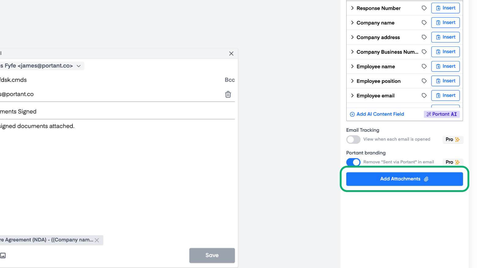
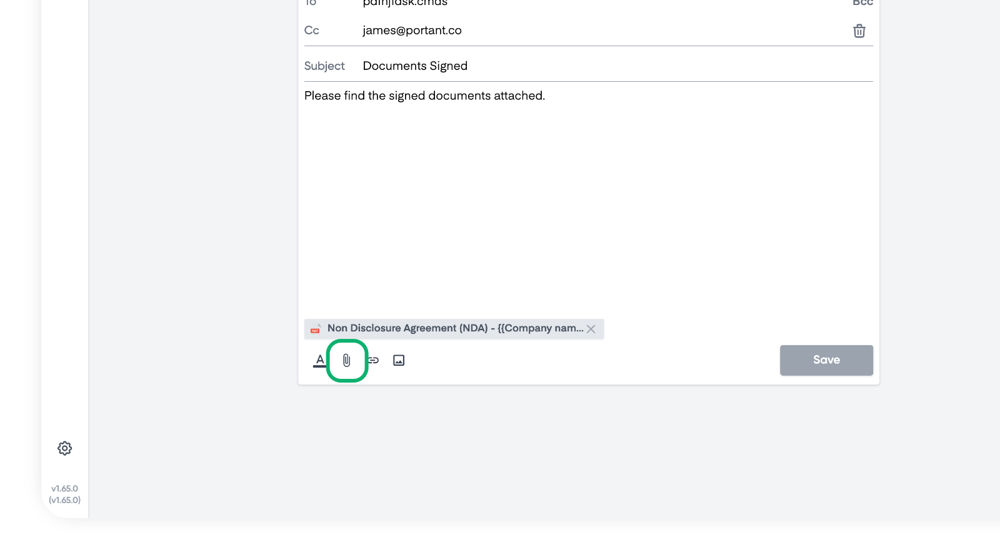
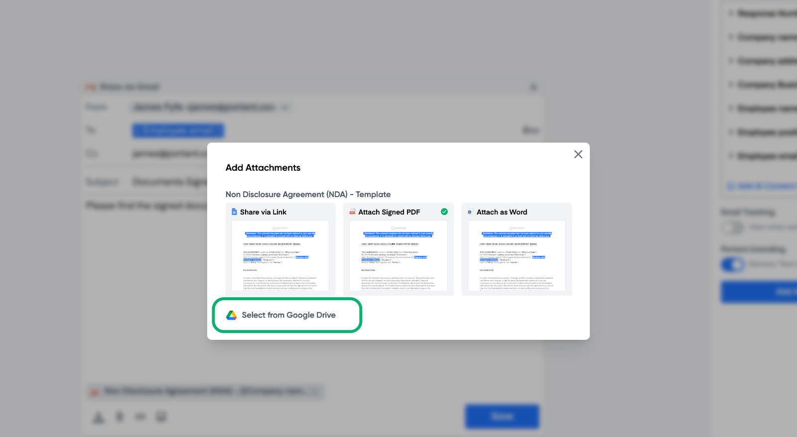
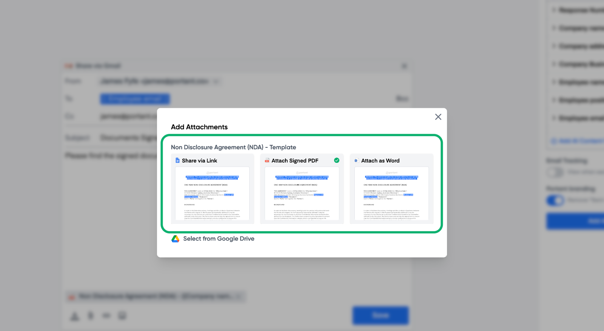
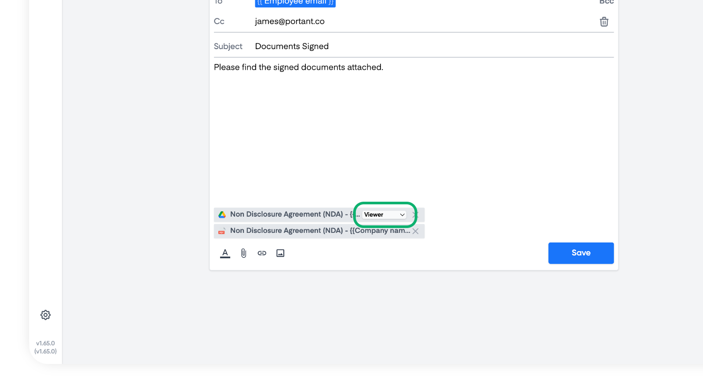
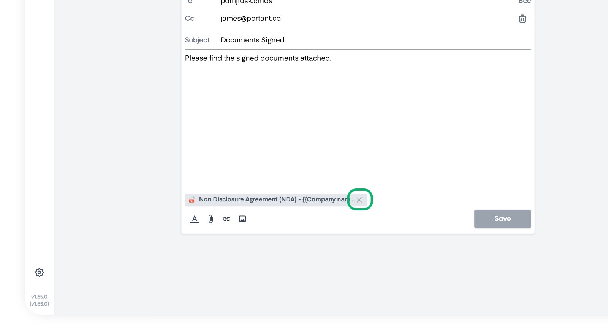

# Share a Doc via Email

How to send a personalised email using Gmail and also shared documents from your workflow

In this article, you will learn how to:

1. Send emails via Gmail
2. Share documents and attach PDFs

### ‍Send email via Gmail

To add an email block click the '**+**' icon below the document block and select the Gmail block:

<figure><figcaption>
Click the '<strong>+</strong>' button
</figcaption></figure>

<figure><figcaption>
Select the Gmail block
</figcaption></figure>

> **Note** - You can also send emails via Outlook. Read [this guide](send-outlook-emails.md) to learn more.

Once you have created a new email block you will see the options to add a To, CC or BCC address in the email block. In these fields you can type email addresses or use tags from the source table on the right hand side. Then below that you can also enter a subject line and a message. There are some formatting options that enable you to make the email look the way you want it to:

<figure><figcaption></figcaption></figure>

Then click save at the bottom and close the email block.

### How to share documents via email

You can also attach document output(s) from your workflow to the email. For example you can select to share Google Slides/Docs with Viewer, Commenter or Editor permissions or attach a PDF to the email.

To add an attachment you can click the button on the right panel here:

<figure><figcaption></figcaption></figure>

Or you can click the paper clip at the bottom of the email, here:\

<figure><figcaption></figcaption></figure>

#### Attaching a file from your Google Drive

After you click one of these options, you can select what type of file you want to share. You can select a file from your Google Drive:

<figure><figcaption></figcaption></figure>

#### Attaching a file from your workflow

Or you can select a file from your workflow:

<figure><figcaption></figcaption></figure>

You can select to share documents from your workflow as a:&#x20;

* **Google Docs/Slides file** - link to shared file added to the email
* **PDF** - file attached to the email
* **Microsoft Word/Powerpoint file** - file attached to the email

If you select to share the files as a PDF or Microsoft Word/Powerpoint file. Then the files will be attached to the email. We have written articles with more information on [Microsoft Word](../automation/converting-docs-to-different-file-types/microsoft-word-.docx.md) and [Microsoft Powerpoint](../automation/converting-docs-to-different-file-types/microsoft-powerpoint.md) files.

#### Selecting to share a Google Doc/Slides file with bespoke permissions

After you have selected to share a Google Doc/Slides file, you can select the permissions the file is shared with. To select the permissions, click the menu here:

<figure><figcaption></figcaption></figure>

You can select to share the file with the following permissions:

* **Viewer**: People can access, but can’t change or share the file with others.&#x20;
* **Commenter**: People can make comments and suggestions, but can’t change or share the file with others.&#x20;
* **Editor**: People can make changes, accept or reject suggestions, and share the file with others.&#x20;

### How to remove an attached file from the email

To remove an attached file from the email click the '**x**' button, here:

<figure><figcaption></figcaption></figure>

#### **Feedback and feature suggestions**

We created Portant in 2021, and the feedback we have received since then has been very helpful and greatly appreciated. If you have any feedback, please feel free to send us an email at contact@portant.co

Thanks,

Blake and James

‍

‍
