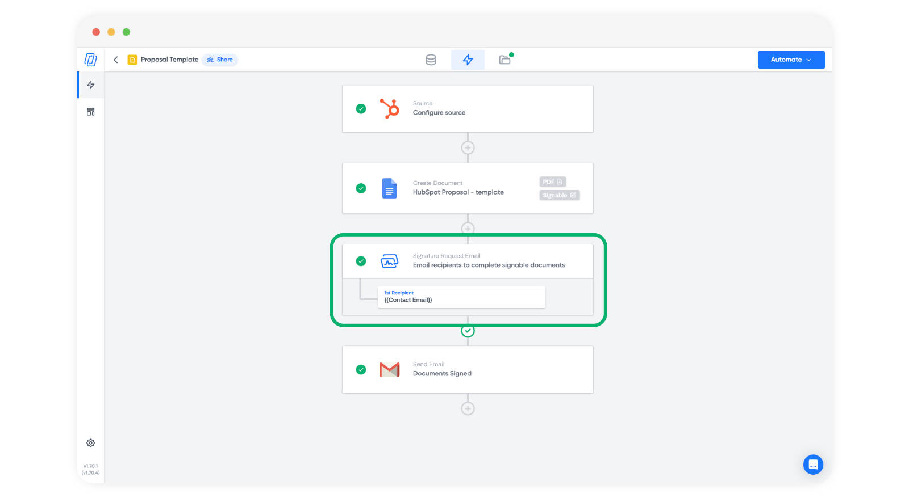
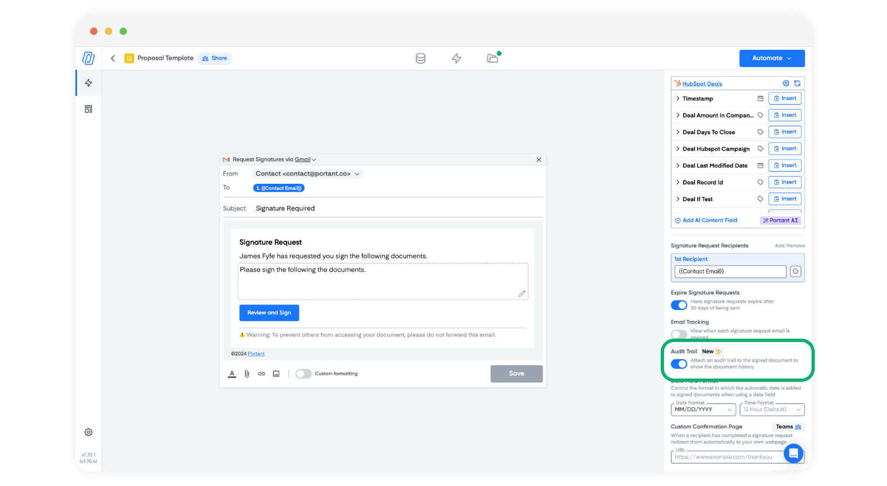

# Add Audit to eSignatures

An audit trail records and preserves the history of actions associated with your eSignatures and appends an audit trail to the end of the document. This step-by-step guide will show you how to seamlessly integrate an audit trail into your eSignature process, making it more secure and transparent.

### Add a Signature Request to Your Workflow

To enable the signature audit trail you first need to create an eSignature workflow. We have written an article on [how to get started with Portant's eSignature](getting-started.md).&#x20;

### Open the Signature Request Block

Once you've added an eSignature to your workflow (or opened a workflow with an eSignature in it) click on the signature request block here:

<figure><figcaption></figcaption></figure>

### Enable the Audit Trail

Inside the signature request block, you will see an option on the right hand side to enable the Audit trail. This will be OFF by default. Click the toggle to turn it on and activate the audit trail for your document.

<figure><figcaption></figcaption></figure>

### Verify the Audit Trail is Active

To confirm that the audit trail has been successfully added, you might want to run a test eSignature request to view a sample or a brief overview of what the audit trail will look like or the kind of information it will track.

### What does the Audit Trail look like?

The Audit Trail adds a section to the end of the signed document that contains details about the document and then a timeline of when and where recipients viewed and signed it. It will look like this:

<figure><figcaption></figcaption></figure>

### Why Add an Audit Trail?

Adding an audit trail to your eSignature process offers several benefits:

* **Enhanced Security:** It adds an extra layer of security by tracking who signed the document and when.
* **Legal Compliance:** Many industries and countries require an audit trail for legal compliance, ensuring that digital signatures meet regulatory standards.
* **Transparency and Trust:** An audit trail provides transparency, making it easier to resolve disputes and increasing trust among parties involved in the signing process.

Implementing an audit trail into your eSignature process is a straightforward step to enhance the security, compliance, and trust of your agreements. By following these simple steps, you can ensure that your documents are not only legally compliant but also secure and transparent to all parties involved.

### **Feedback and feature suggestions**

We created Portant in 2021 and the feedback we have received since then has been very helpful and greatly appreciated. If you have any feedback, please feel free to send us an email at contact@portant.co

