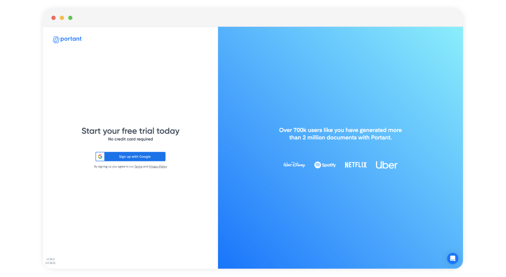

# How to Sign up

Discover how easy it is to sign up for Portant at no cost, with the option to trial our Pro Plan. You won't need to provide your credit card information, so when your trial ends, your account will automatically revert to the Free Plan, unless you choose to upgrade it.

In this article you will learn how to:

#### 1. How to create a Portant account with your current Google email address: in 5 easy steps

## How to create a Portant account with your current Google email address: in 5 easy steps

#### Step 1

To get started, visit [https://www.portant.co](https://www.portant.co)  and click on the "Sign Up" button as shown below:

<figure><figcaption></figcaption></figure>

**Step 2**

Click on "Sign up with Google":

<figure><figcaption></figcaption></figure>

**Step 3**

Enter your Google email address and click "Next".\

<figure><figcaption></figcaption></figure>

**Step 4**

Enter your password and click "next":

<figure><figcaption></figcaption></figure>

**Step 5**

Finally, you will see this screen with a brief video welcoming you to Portant App:\

<figure><figcaption></figcaption></figure>

You're now logged in to your Portant account and can experience its full power with all Pro features! For further insights into the Portant App, feel free to explore our Guide Page [here](https://docs.portant.co/portant-docs)!

\

#### Feedback and feature suggestions

We created Portant in 2021 and the feedback we have received since then has been very helpful and greatly appreciated. If you have any feedback please feel free to send us an email at contact@portant.co

Thanks,

Blake and James

\
