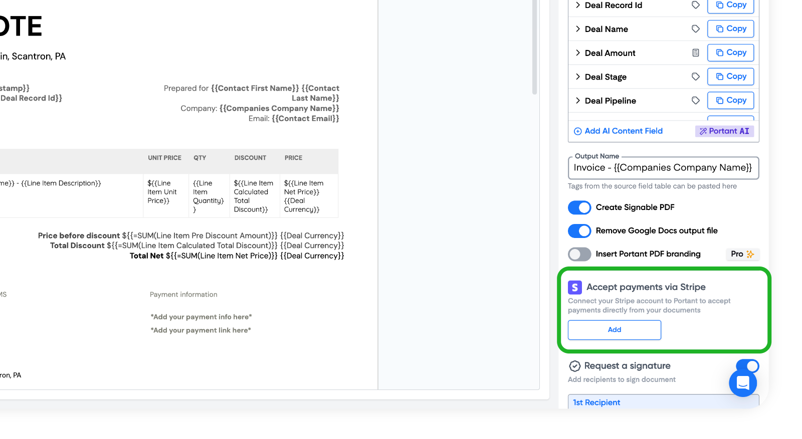
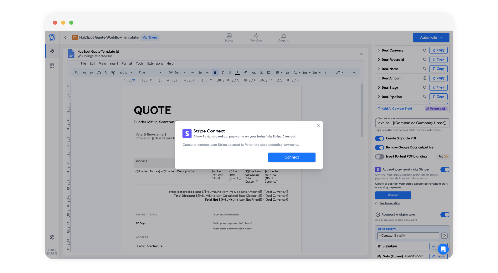
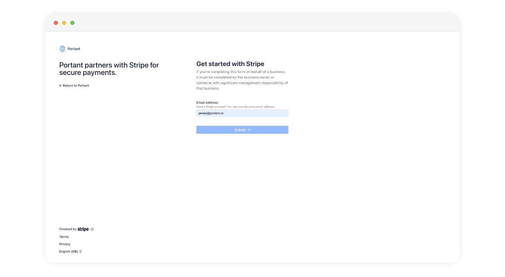
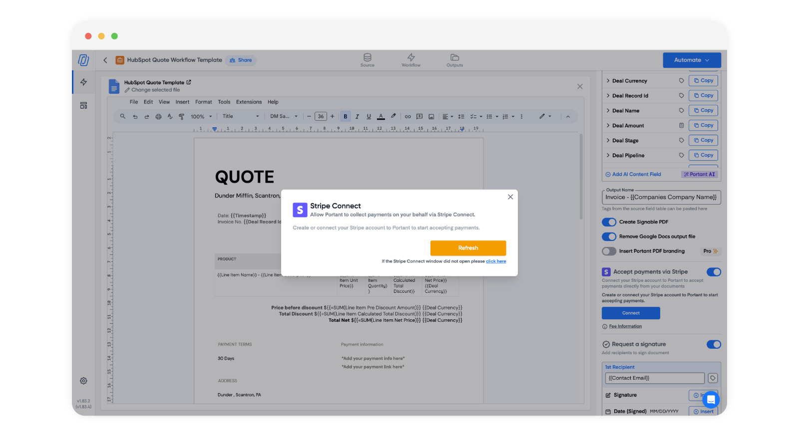
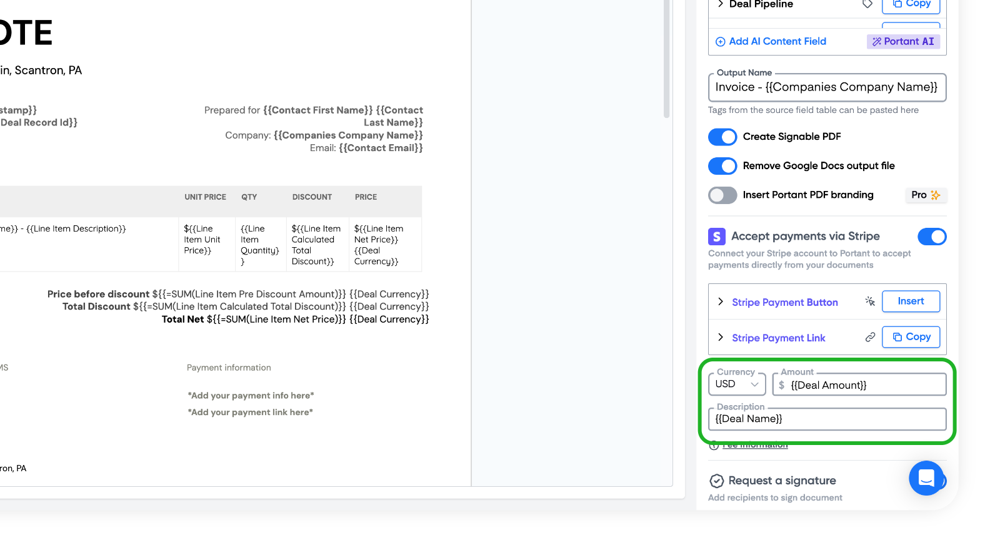
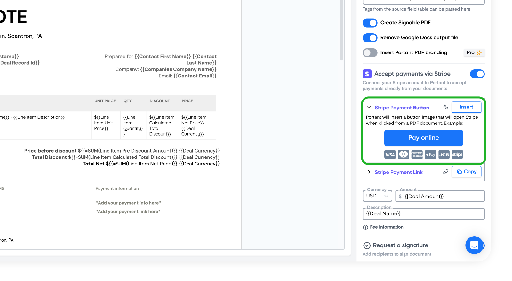
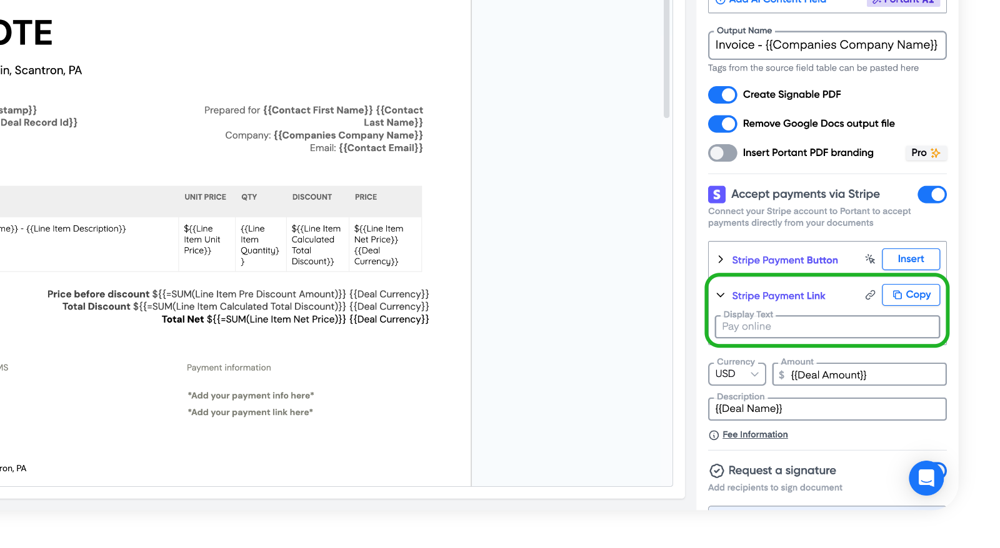
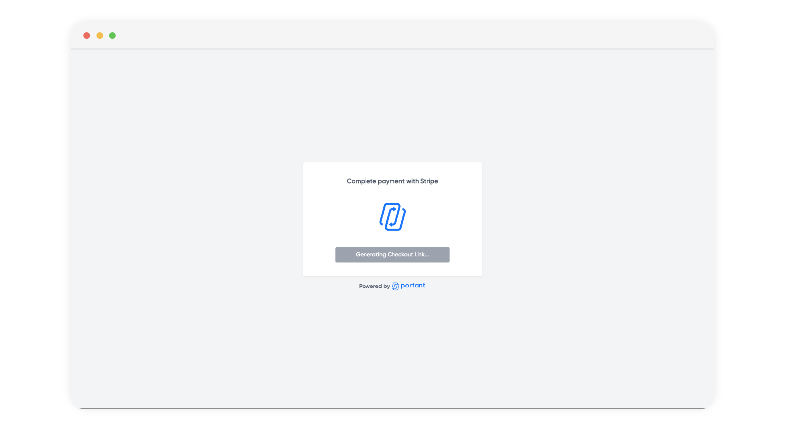
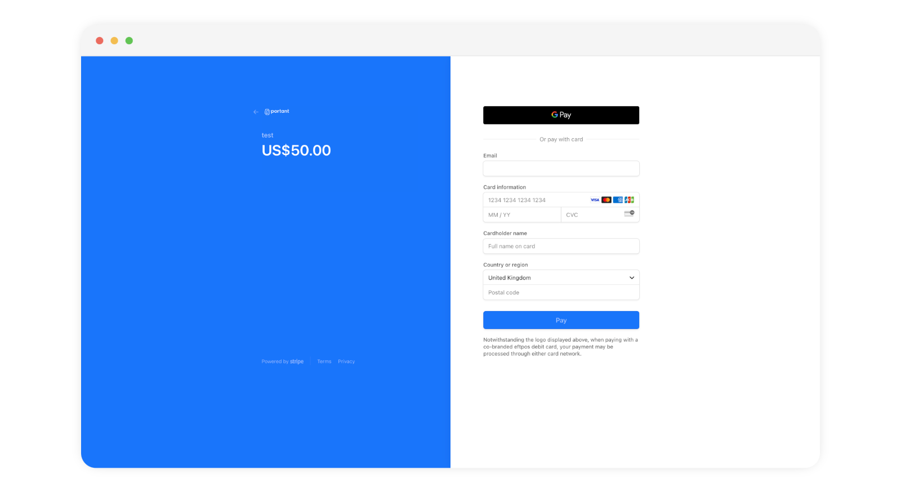

# Add online payment links



Streamlining payment processes is crucial for businesses of all sizes. Using Portant, you can add payment links to documents and emails to request payments efficiently.&#x20;

In this guide we will show you:

1. How to set up and connect your Stripe account
2. How to customise your payment link
3. An example of an online payment using Portant and Stripe
4. How to change your payment fees

### How to set up and connect your Stripe account

On the right side of your document or email block you will see a section to accept payments via Stripe. Click the 'Add' button.

<figure><figcaption></figcaption></figure>

Then click the 'Connect' button

<figure><figcaption></figcaption></figure>

After that, sign into your Stripe account or set up a new one.

<figure><figcaption></figcaption></figure>

When you have finished setting up your account you need to refresh the connection by clicking the 'Refresh' button.&#x20;

<figure><figcaption></figcaption></figure>

Now you have connected your Stripe account you will be able to add payment links connected with this account to any workflow.

> **Note:** If you have a teams account you can select that your Stripe account is used for any shared Team's workflow (only editable by Team Editors)

### How to customise your payment link

The first thing you will need to do is select your currency, amount and description for your payment link. These can be static values, or you can use \{{fields\}} from your source to dynamically change them:

<figure><figcaption></figcaption></figure>

After you have set up the details of the payment links, you can add the payment link/button into your document. To see a preview of the Stripe Payment button, please expand the row.

<figure><figcaption></figcaption></figure>

The payment button is inserted as an image in your document, so you can crop the image to exclude the payment types below the button, like this:

<figure><figcaption></figcaption></figure>

> **Note** When you insert the payment button, it will be inserted at the end of your doucment.

The payment link display text can also be altered by expanding the row link this:

<figure><figcaption></figcaption></figure>

This will allow you to insert display text like 'Pay online' instead of the link.

### An example of an online payment using Portant and Stripe

When the document is created, Portant creates a payment link unique for that document/email. When the user clicks on the link they will be taken to a screen that then takes them to a payment page like this:

<figure><figcaption></figcaption></figure>

Then the checkout page will be displayed. The branding and colour used on this page can be customised in your Stripe settings: [https://dashboard.stripe.com/settings/branding/checkout](https://dashboard.stripe.com/settings/branding/checkout)

<figure><figcaption></figcaption></figure>

### Payment fees

There are two fees for payments, the Stripe processing fee and the Portant fee. The Stripe fee is set by Stripe and can't be changed, but Portant fee changes depending on your subscription tier:

| Tier  | Fee                |
| ----- | ------------------ |
| Free  | 5% + Stripe Fees   |
| Pro   | 1% + Stripe Fees   |
| Teams | 0.5% + Stripe Fees |

#### **Feedback and feature suggestions**

We created Portant in 2021, and the feedback we have received since then has been very helpful and greatly appreciated. If you have any feedback, please feel free to send us an email at contact@portant.co
