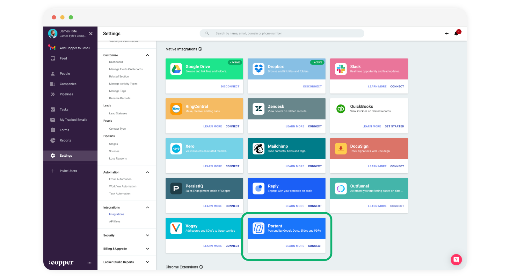
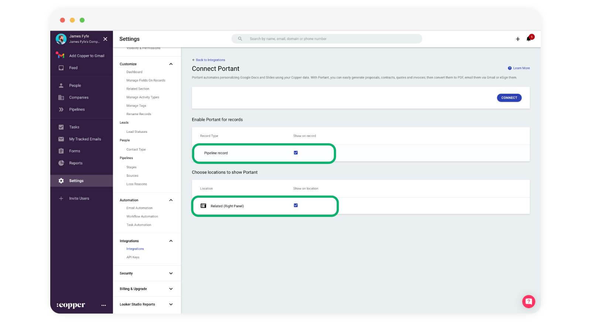
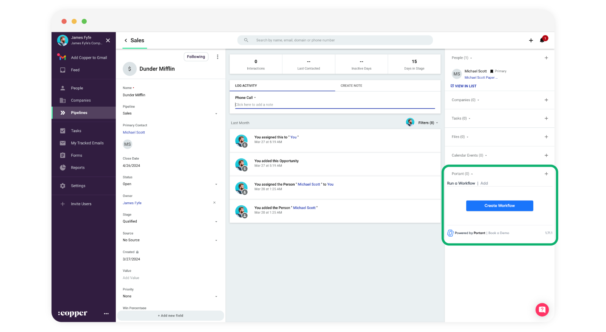
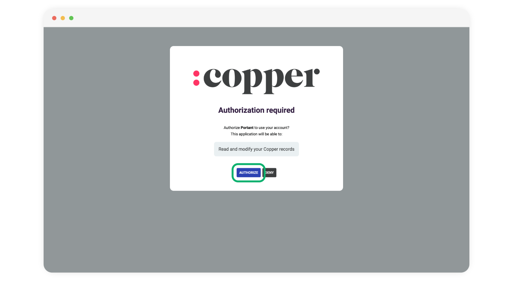
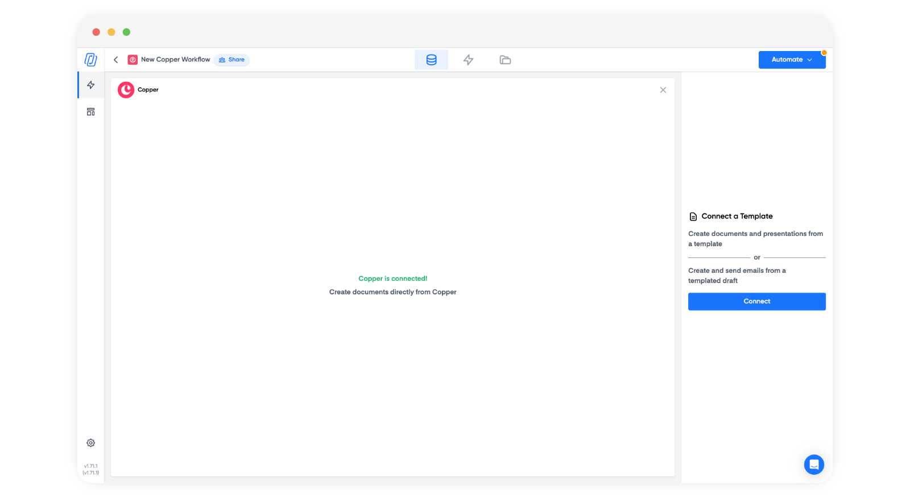
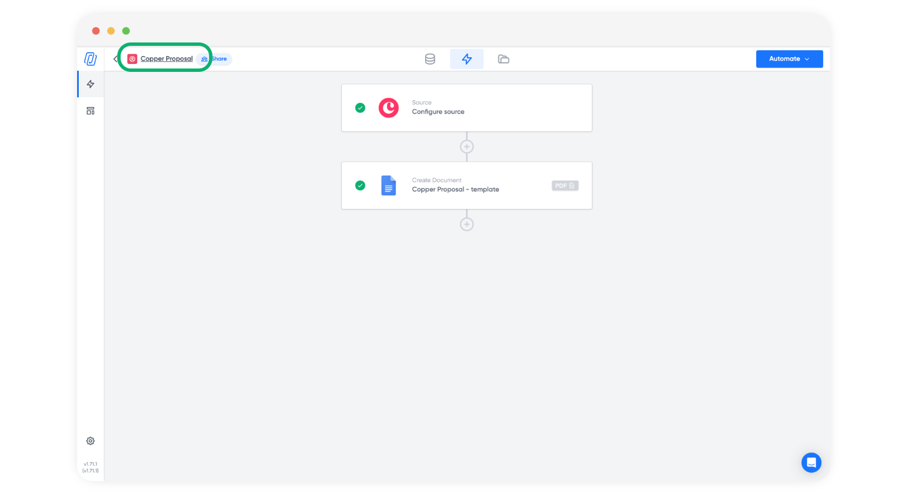

# Copper



In this guide you will learn how to install our Copper integration, then create your first workflow and start generating contracts/proposals/quotes/invoices from Copper

**Step 1: Installing the Integration**

* Navigate to your Copper account.
* Go to **Settings > Integrations > Integrations** and search for **Portant** in **Native integrations** here:

<figure><figcaption></figcaption></figure>

* Then click **CONNECT**

<figure><figcaption></figcaption></figure>

* Then make sure the following checkboxes are selected:
  * Enable Portant for records > Pipeline record  ✅
  * Choose locations to show Portant > Related (Right Panel)  ✅

<figure><figcaption></figcaption></figure>

* Then click "**CONNECT**"

<figure><figcaption></figcaption></figure>

* After you have done this, when you go back to the integration page, you will see an Active tag in the top right corner of the Portant card here:

<figure><figcaption></figcaption></figure>

**Step 2: Launching Portant in Copper**

Now that you had successfully installed the Portant integration on your Copper account. It is time to create your first workflow in Portant:

* Open an opportunity in Copper and you will see the Portant integration on the right hand side, here:

<figure><figcaption></figcaption></figure>

* Click the "Create Workflow" button in the integration and a new tab will open and create the start of a workflow in Portant.
* The next thing to do is connect Portant to Copper (you only have to do this once). To connect, click on the Copper block, here:

<figure><figcaption></figcaption></figure>

* Then click 'Connect Copper to Portant'

<figure><figcaption></figcaption></figure>

* Then authorise Portant to use your account:&#x20;

<figure><figcaption></figcaption></figure>

* After you have completed this step the Copper block will say "Copper is connected"

<figure><figcaption></figcaption></figure>

* After this you can add a document into your workflow by click the plus button here:

<figure><figcaption></figcaption></figure>

* Then select to connect a document or email to the workflow

<figure><figcaption></figcaption></figure>

* Then you can add copper fields to the document template. For more details on how to personalise the document, please check out our [document personalisation section](broken-reference).

<figure><figcaption></figcaption></figure>

* You can also edit the output document name and add \{{tags\}} to personalise each output.

<figure><figcaption></figcaption></figure>

* Finally you car customise the name of the workflow by clicking the workflow name (so you can select to run the right one in Copper)

<figure><figcaption></figcaption></figure>

**Step 3: Running the Workflow**

* Back in your Copper account, you should see the name of your workflow and a "Start" button next to it. Click the **Start** button to run the workflow.

<figure><figcaption></figcaption></figure>

When you "**Start**" the workflow the data from the opportunity (and connected objects) will be used to create a new output document and the document links will be added to the activity feed and the files section.

**Step 4: Viewing the Output**

* On the right side of your screen in Copper, locate the "Files" section. Click the dropdown button to view the attached output.

<figure><figcaption></figcaption></figure>

#### Feedback and feature suggestions

We created Portant in 2021 and the feedback we have received since then has been very helpful and greatly appreciated. If you have any feedback please feel free to send us an email at [contact@portant.co](mailto:contact@portant.co)\

Thanks,\

Blake and James

\
\
