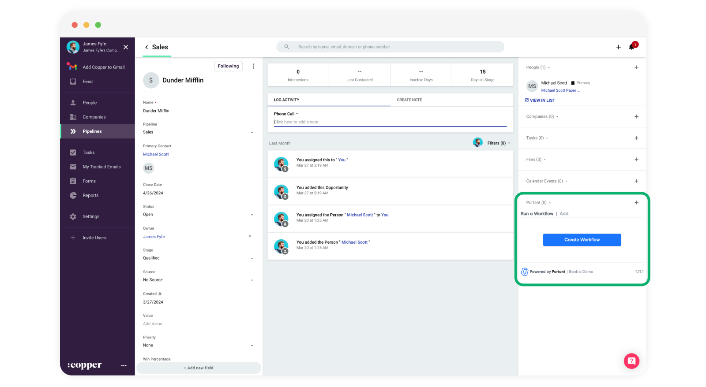
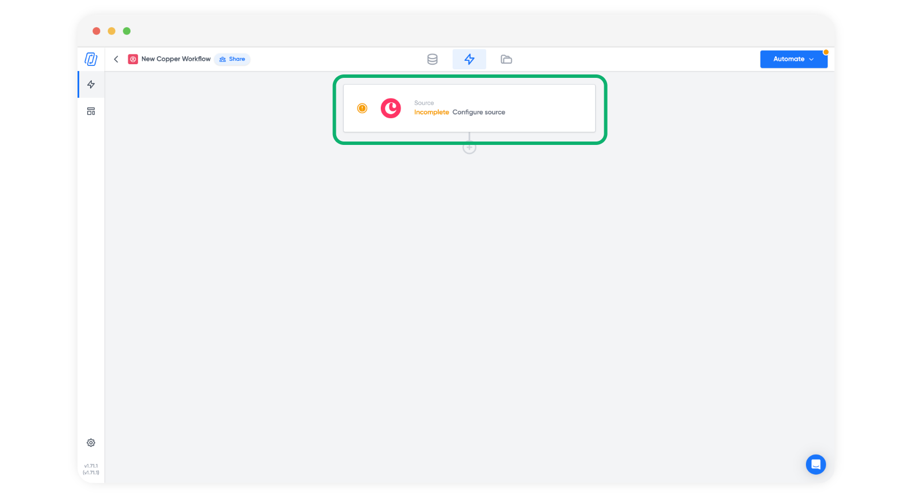
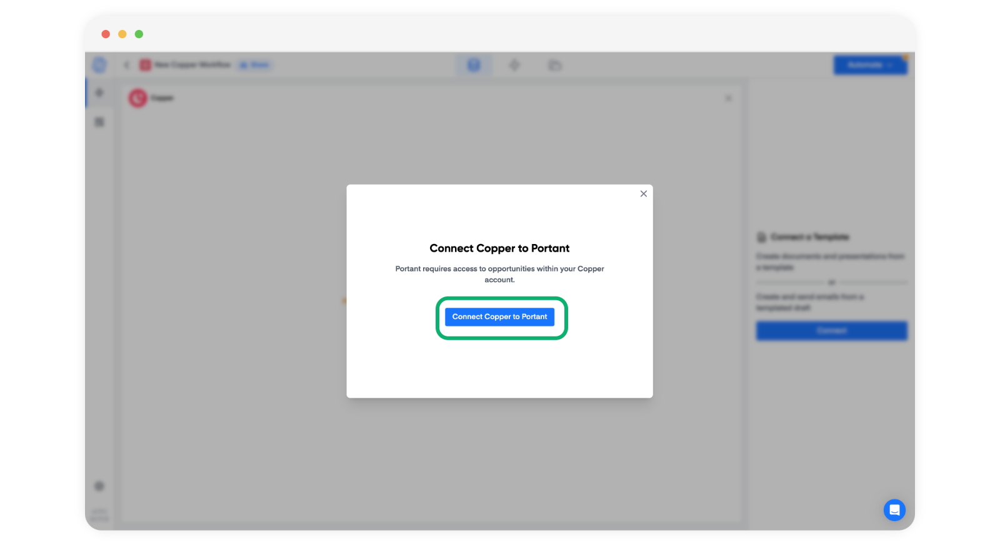
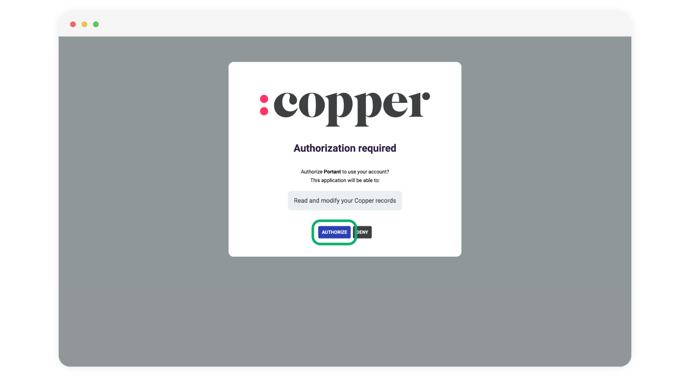
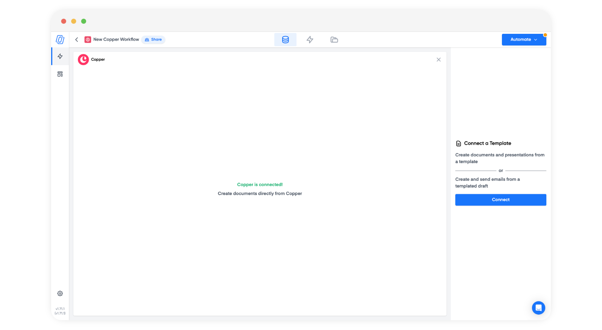
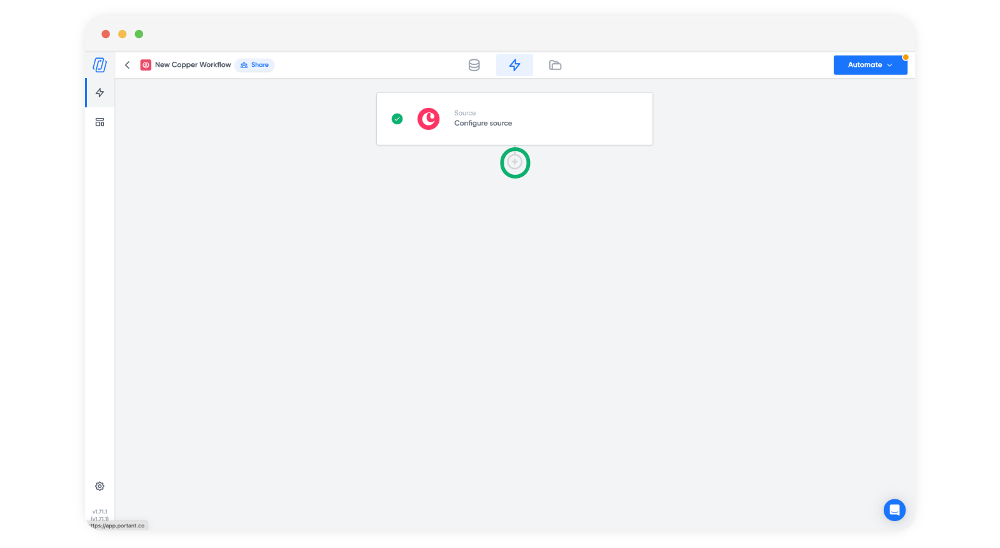
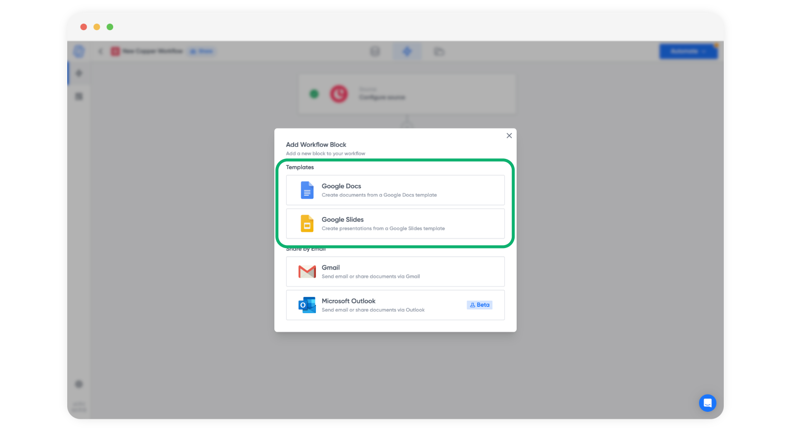
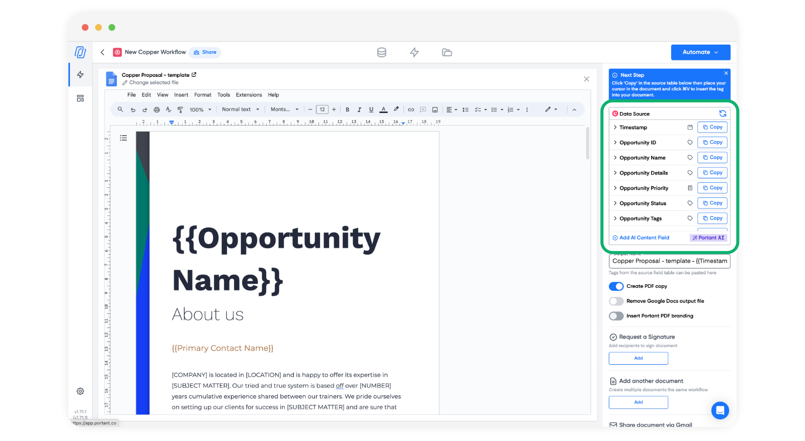
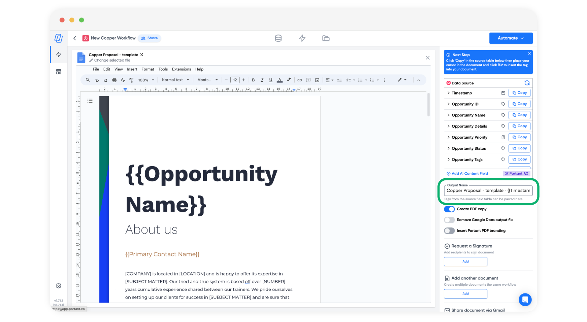
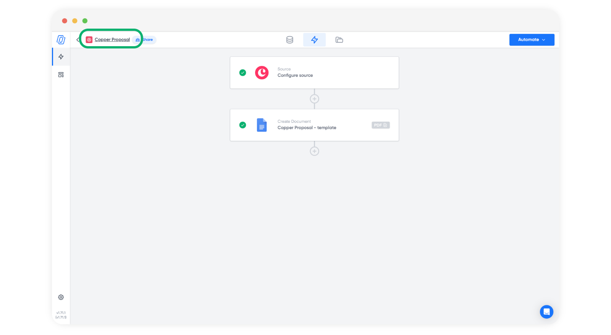

# Create your first Copper workflow

Now that you had successfully installed the Portant integration on your Copper account. It is time to create your first workflow in Portant:

* Open an opportunity in Copper and you will see the Portant integration on the right hand side, here:

<figure><figcaption></figcaption></figure>

* Click the "Create Workflow" button in the integration and a new tab will open and create the start of a workflow in Portant.
* The next thing to do is connect Portant to Copper (you only have to do this once). To connect, click on the Copper block, here:

<figure><figcaption></figcaption></figure>

* Then click 'Connect Copper to Portant'

<figure><figcaption></figcaption></figure>

* Then authorise Portant to use your account:&#x20;

<figure><figcaption></figcaption></figure>

* After you have completed this step the Copper block will say "Copper is connected"

<figure><figcaption></figcaption></figure>

* After this you can add a document into your workflow by click the plus button here:

<figure><figcaption></figcaption></figure>

* Then select to connect a document or email to the workflow

<figure><figcaption></figcaption></figure>

* Then you can add copper fields to the document template. For more details on how to personalise the document, please check out our [document personalisation section](broken-reference).

<figure><figcaption></figcaption></figure>

* You can also edit the output document name and add \{{tags\}} to personalise each output.

<figure><figcaption></figcaption></figure>

* Finally you car customise the name of the workflow by clicking the workflow name (so you can select to run the right one in Copper)

<figure><figcaption></figcaption></figure>

#### **F**eedback and feature suggestions

We created Portant in 2021 and the feedback we have received since then has been very helpful and greatly appreciated. If you have any feedback please feel free to send us an email at [contact@portant.co](mailto:contact@portant.co)\

Thanks,\

Blake and James

\
\
