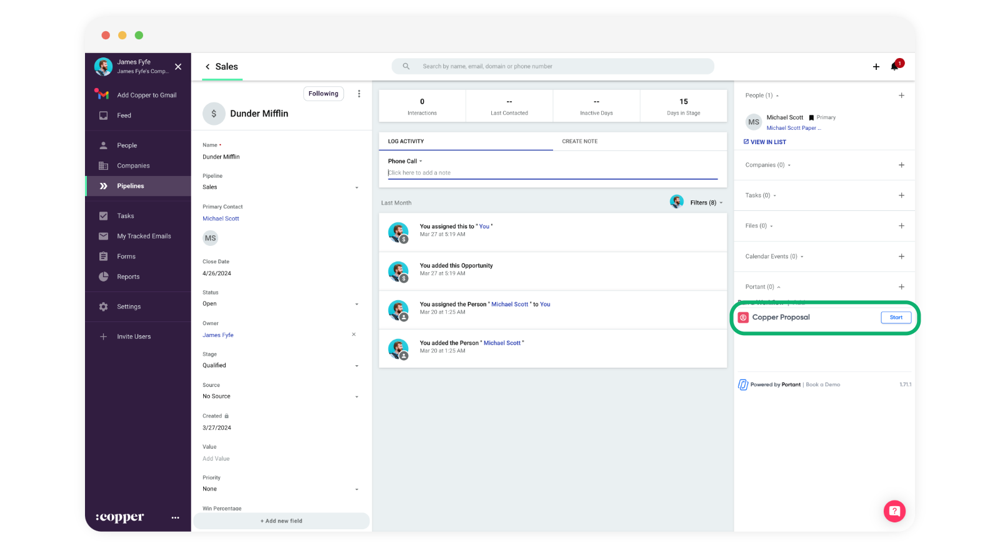

# Generating your first document from Copper

**Running the Workflow**

* Back in your Copper account, you should see the name of your workflow and a "Start" button next to it. Click the **Start** button to run the workflow.

<figure><figcaption></figcaption></figure>

When you "**Start**" the workflow the data from the opportunity (and connected objects) will be used to create a new output document and the document links will be added to the activity feed and the files section.

**Viewing the Output**

* On the right side of your screen in Copper, locate the "Files" section. Click the dropdown button to view the attached output.

<figure><figcaption></figcaption></figure>

#### Feedback and feature suggestions

We created Portant in 2021 and the feedback we have received since then has been very helpful and greatly appreciated. If you have any feedback please feel free to send us an email at [contact@portant.co](mailto:contact@portant.co) \

Thanks,\

Blake and James

\
\
