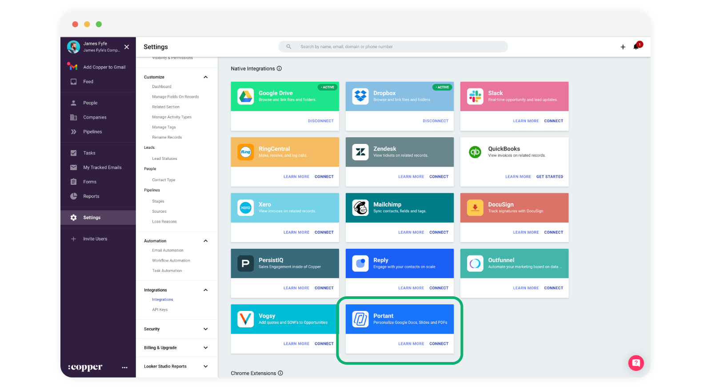
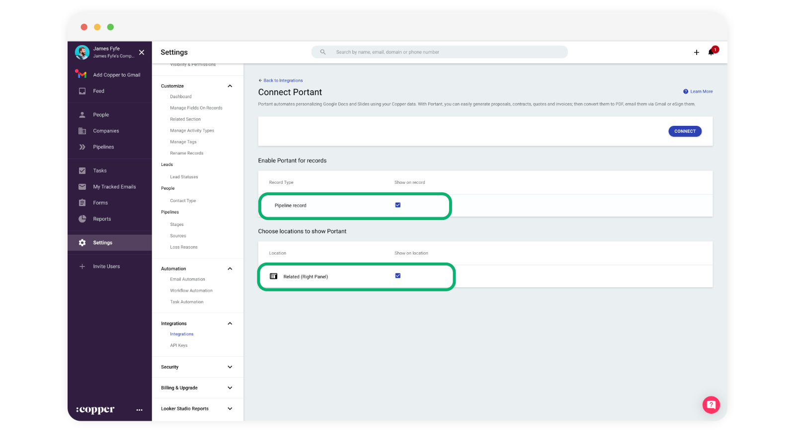
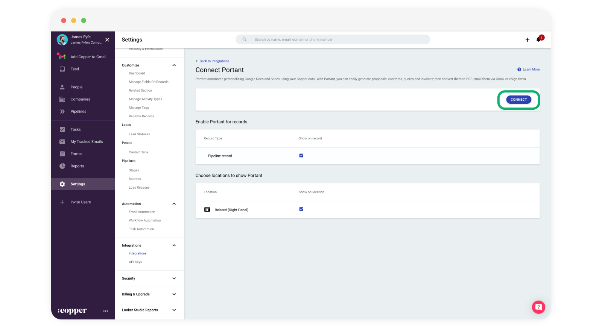
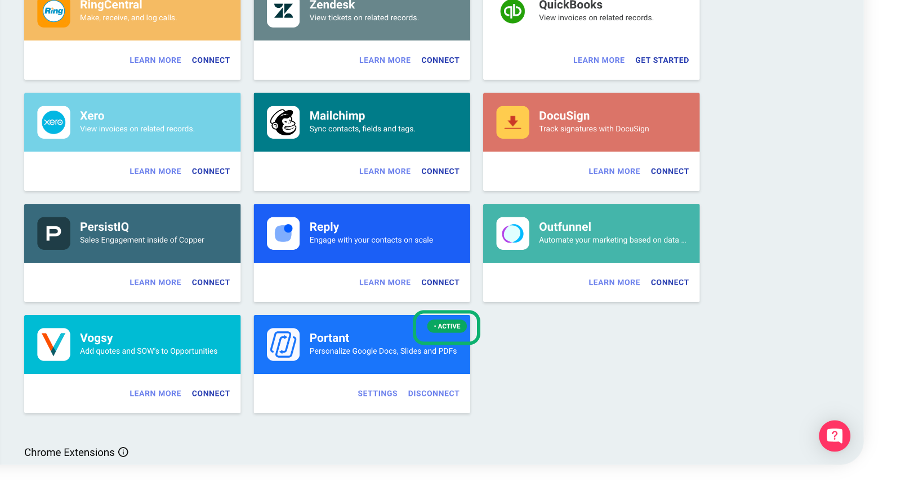

# Installing the Copper integration

In this guide you will learn how to install our Copper integration.

* Navigate to your Copper account.
* Go to **Settings > Integrations > Integrations** and search for **Portant** in **Native integrations** here:

<figure><figcaption></figcaption></figure>

* Then click **CONNECT**

<figure><figcaption></figcaption></figure>

* Then make sure the following checkboxes are selected:
  * Enable Portant for records > Pipeline record  ✅
  * Choose locations to show Portant > Related (Right Panel)  ✅

<figure><figcaption></figcaption></figure>

* Then click "**CONNECT**"

<figure><figcaption></figcaption></figure>

* After you have done this, when you go back to the integration page, you will see an Active tag in the top right corner of the Portant card here:

<figure><figcaption></figcaption></figure>

#### Feedback and feature suggestions

We created Portant in 2021 and the feedback we have received since then has been very helpful and greatly appreciated. If you have any feedback please feel free to send us an email at [contact@portant.co](mailto:contact@portant.co)\

Thanks,\

Blake and James

\
\
