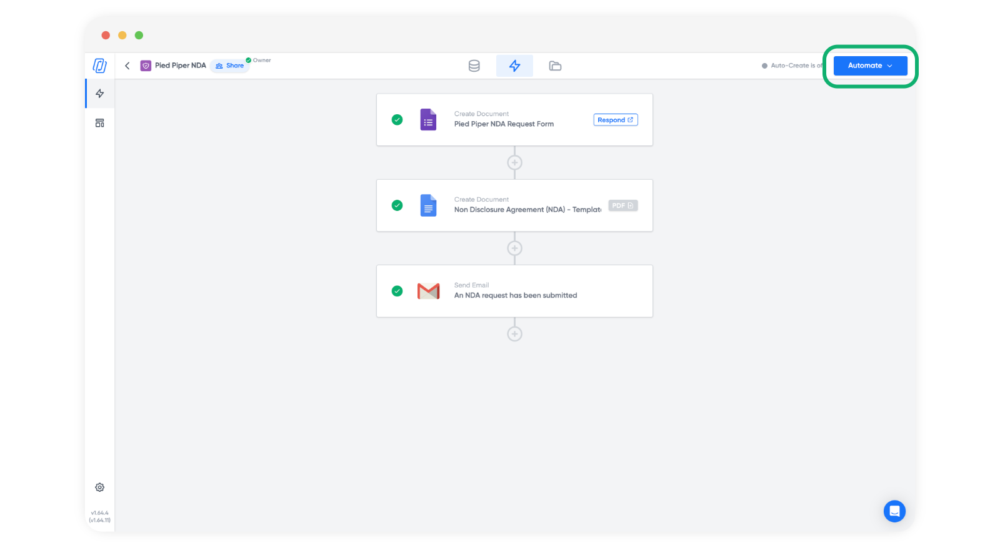
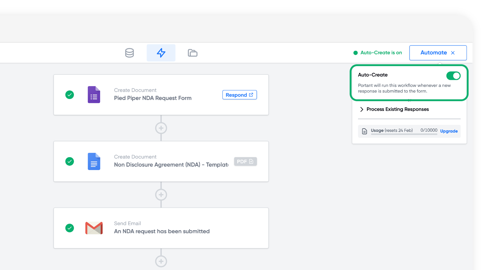
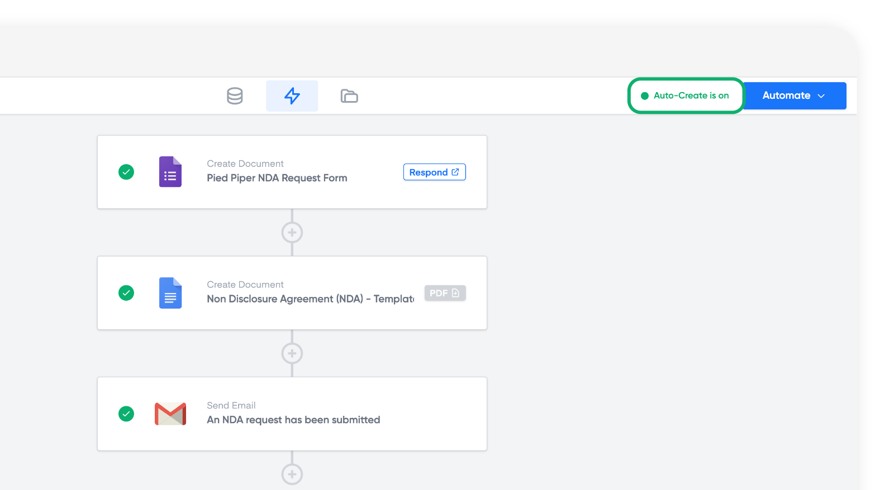
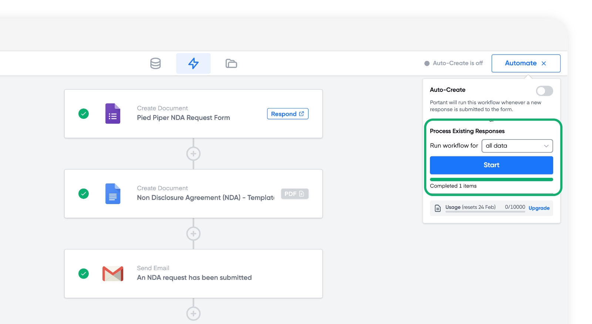
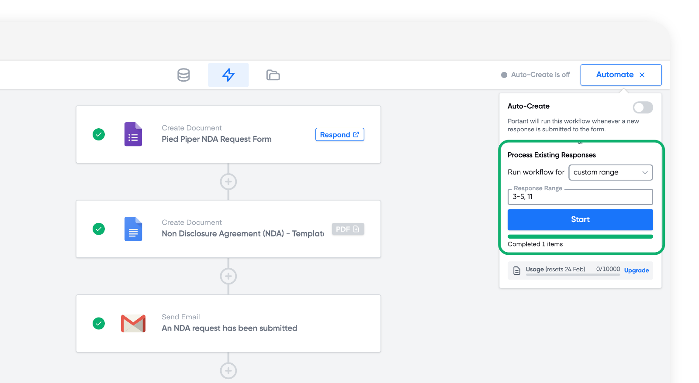

# Google Forms

Google Forms is a great source when you need to collect data from a group or set up a continuous workflow that's always ready to accept new data and generate documents. In this article you'll learn how to:

1. Turn on Auto-create for your Google Form
2. Manually process previous responses

### How to turn on Auto-create for your form

When you have a completed workflow (for example a workflow that contains at least a Google Form and a Doc/Slide/Email), you can click the 'Automate' button in the top right of the screen, here:

<figure><figcaption></figcaption></figure>

After you do that you can turn on the Auto create toggle here:

<figure><figcaption></figcaption></figure>

This will take a second to initialise and then a status will appear in the top right of your screen to let you know Auto-create is on&#x20;

<figure><figcaption></figcaption></figure>

Now any time a response is submitted to the form the response will be processed by the workflow

### Manually process previous responses

If you need to process responses which have already been submitted, you can manually process them using Portant. To manually process old Form responses click the 'Automate' button in the top right corner of the screen, here:

<figure><figcaption></figcaption></figure>

When you click the button a menu will open with options of how to automate the data. You can process all the form responses by clicking the Start button here:

<figure><figcaption></figcaption></figure>

Or you can process a selection of the responses by changing the dropdown option 'Custom range' then entering a selection of responses, like this:

<figure><figcaption></figcaption></figure>

In this example we have selected to run responses 3 through to 5 and row 11. You can enter a dash (-) between two numbers if you want to select a range of responses and you can enter multiple numbers separated by commas if you want each response processed.

> The response numbers are the numbers of the responses in chronological order.

> **Note** - If you delete a response from your Google Form this will change all response numbers after the deleted response. The Response number calculates the number of the response based on all current (non deleted) responses

#### Feedback and feature suggestions

We created Portant in 2021, and the feedback we have received since then has been very helpful and greatly appreciated. If you have any feedback, please feel free to send us an email at [contact@portant.co](mailto:contact@portant.co)\
