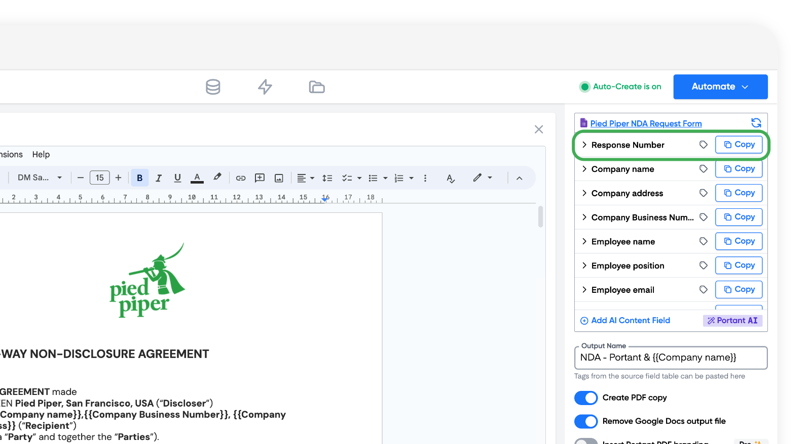
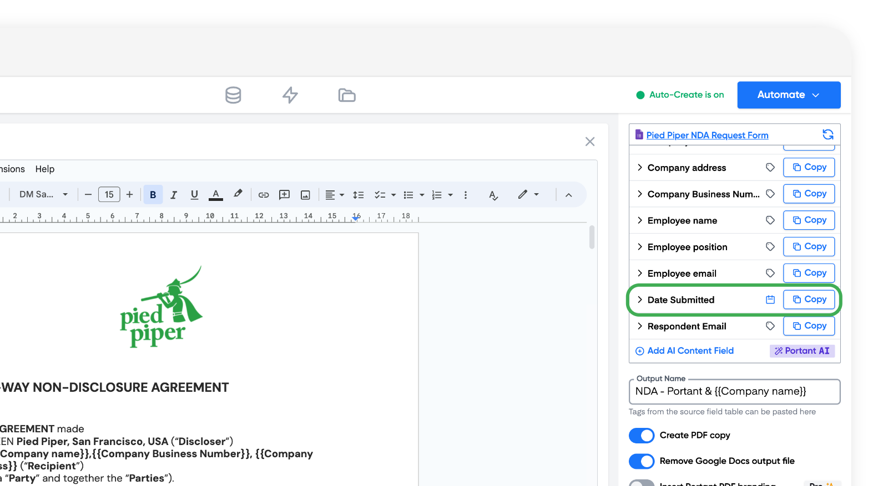
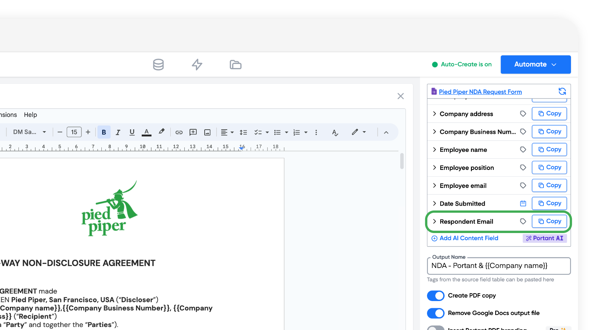

# \{{tags\}} for Google Forms

When working with Google Forms, you may notice some unique tags in your source table that are not  found in other workflows. These tags are:

1. Response Number
2. Date submitted
3. Respondent email

### Response number

This is number of the response in chronological order. &#x20;

> **Note** - If you delete a response from your Google Form this will change all response numbers after the deleted response. The Response number calculates the number of the response based on all current (non deleted) responses

This tag is found at the top of the Source table here:

<figure><figcaption></figcaption></figure>

### Date Submitted

The date submitted is the date the response was submitted. This tags is the penultimate tag in the list at the bottom of the Source table.

<figure><figcaption></figcaption></figure>

### Respondent email

This is the email address of the person who completed your form.

> **Note** - This tag will only work if you request that your Google Form records the email addresses from people who fill out your form. For more info, check out Google Guide on this feature: [https://support.google.com/docs/answer/139706?hl=en#zippy=%2Ccollect-respondents-email-addresses](https://support.google.com/docs/answer/139706?hl=en#zippy=%2Ccollect-respondents-email-addresses)

&#x20;It is the last tag in your source table , here:

<figure><figcaption></figcaption></figure>

> **Note** - a common error is to use this instead of another question in your form which also collects the email address. So if you are having issues with email addresses not displaying please makesure you are using the correct tag.

#### Feedback and feature suggestions

We created Portant in 2021, and the feedback we have received since then has been very helpful and greatly appreciated. If you have any feedback, please feel free to send us an email at [contact@portant.co](mailto:contact@portant.co)
