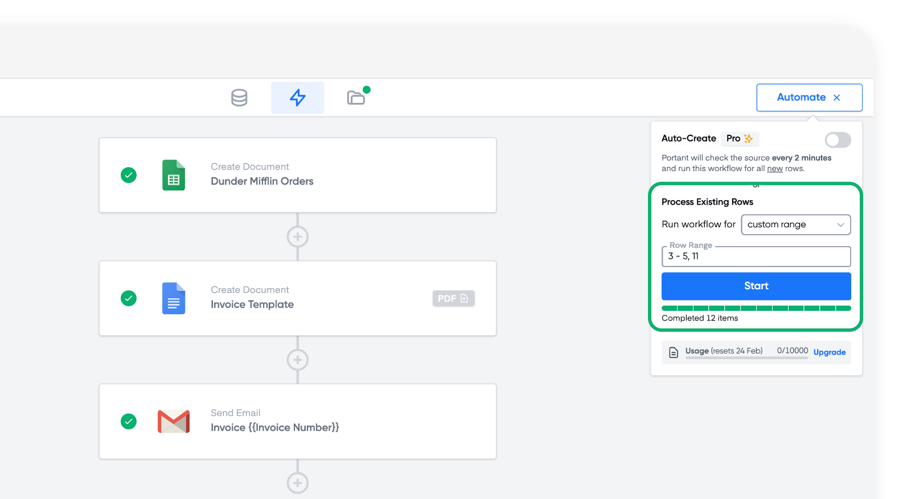

# Google Sheets

Google Sheets is a great source for a workflow if you already have data for the documents you want to create. This can already be in Google Sheets, or you can export the data from another platform in a csv and upload it to Google Sheets. In this guide we will show you how to:

1. How to set up your Google Sheet
2. Process Rows Manually
3. Turn on Auto-create  (✨ _Pro feature_)
4. Data Grouping

### How to set up your Google Sheet

When you set up your Google sheet, the first row ow your spreadsheet should contain your headers and then the data should be organised in rows underneath, like this:

<figure><figcaption></figcaption></figure>

Each row in your spreadsheet will create one document, unless you use our [Data Grouping ](data-grouping.md)feature

### How to process rows manually

There are two options to process data using a Google Sheet, you can set up Portant to process rows automatically or manually process them.

To process rows manually, click the 'Automate' button in the top right of the screen, here:

<figure><figcaption></figcaption></figure>

When you click the button a menu will open with options of how to automate the data. You can process all the data in the spreadsheet by clicking the start button here:

<figure><figcaption></figcaption></figure>

Or you can process a selection of the rows by changing the dropdown option 'Custom range' then entering a selection of rows, like this:

<figure><figcaption></figcaption></figure>

In this example we have selected to run rows 3 through to 5 and row 11. You can enter a dash (-) between two numbers if you want to select a range and you can enter multiple numbers separated by commas if you want each row processed.

### How to turn on Auto-create (✨ _Pro feature_)

You can turn on Auto create by clicking the Automate button in the top right of the screen, here:

<figure><figcaption></figcaption></figure>

This means that every time new data is entered into your spreadsheet it will be processed. You can learn more about Auto-create in t[his article](google-sheets-auto-create.md). When it is switched on a status appears here:

<figure><figcaption>
If you can't see this status, Auto-create is not on.
</figcaption></figure>

### How to use Data Grouping

Data grouping is a great feature if you need to place multiple rows from the same spreadsheet into the same document. For example if you have 5 rows with line item data for an invoice. You could use the invoice number to group the information and enter it into the same documents. You can learn more about Data Grouping in [this article](data-grouping.md).

#### Feedback and feature suggestions

We created Portant in 2021, and the feedback we have received since then has been very helpful and greatly appreciated. If you have any feedback, please feel free to send us an email at [contact@portant.co](mailto:contact@portant.co)\

‍
