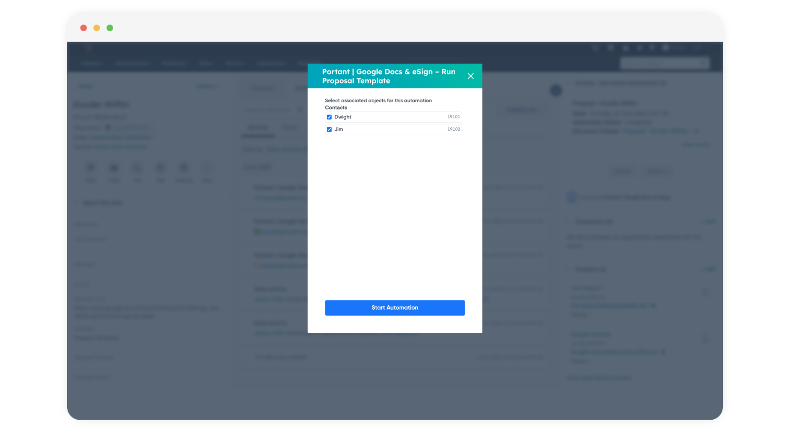

# HubSpot



In today's fast-paced business environment, data is a crucial component of decision-making. One of the most powerful tools for harnessing data is HubSpot, a comprehensive marketing, sales, and service platform. But did you know that HubSpot data can also be used as a data source for Portant? This article will explore the various ways in which HubSpot data can be used to create customized documents, from sales proposals to customer invoices. 

**In this article, you’ll learn how to:**

1. Login to Portant and create a workflow
2. Select HubSpot as your Workflow Source
3. Install the Portant HubSpot App and link your accounts
4. Format and customise your document template
5. Generate your first document

#### Login to Portant and create a workflow

If you don't already have a Portant account, you can sign up for one for free here: [app.portant.co/signup](https://app.portant.co/signup)

<figure><figcaption></figcaption></figure>

After you have signed up, click the blue button in the top right-hand corner: **New Workflow**.

#### Select HubSpot as your Workflow Source

The next step is to select HubSpot as the source for your workflow.&#x20;

<figure><figcaption></figcaption></figure>

#### Install the Portant HubSpot App and link your accounts

If this is the first time you have selected HubSpot as a Source, then you will be asked to install the [Portant App in HubSpot](https://ecosystem.hubspot.com/marketplace/apps/sales/sales-enablement/portant-hubspot-google-docs-integration), for more details please check out [this guide](how-to-install-the-portant-app-in-hubspot/)

<figure><figcaption></figcaption></figure>

This will allow Portant to source data from HubSpot to customise your documents.

#### Format and customise your document template

When you have successfully connected Portant to HubSpot, your workflow will look like this:

<figure><figcaption></figcaption></figure>

The next step is to connect a document template. You can do this by clicking the 'plus' **(+)** button below the HubSpot block. \

<figure><figcaption></figcaption></figure>

Here you can select to connect a Google Doc, Slides, or even email template to be customised and generated from HubSpot data.

When you have picked your document template, you can customise it by placing HubSpot tags from the Source table into the document. To insert a tag, click **Copy** and then insert your cursor where you'd like the tag to be placed and hit **CTRL + V** or **CMD(⌘) + V**

<figure><figcaption></figcaption></figure>

You can also customise the file name in the right panel and select if you'd like the document to be saved as a PDF.

> **Note:** All PDFs in the Free tier have a Portant watermark in the footer. To remove the watermark, please upgrade to our [Teams or Pro plans](https://app.portant.co/settings/billing)

#### Select your HubSpot Primary Object

When you open the Source page, there is a Dropdown in the top right corner where you can select the Primary Object your workflow will run from, here:

<figure><figcaption></figcaption></figure>

This also determines where you will be able to access your workflow. e.g. If you select Deals as your Primary Object, then you will be able to access the workflow in your Deal CRM Cards. Please note, that other fields connected to your Primary Object will be able to be included in your documents. e.g. If you choose Deal as your primary Object, you will be able to access the Company, Contact, and Line item data connected to that deal.

#### Manage your HubSpot Fields

HubSpot has hundreds of fields that you can include in your document workflow(not to mention your own Custom Properties). Portant has a way to manage which fields to include in your workflow on the source page. Click **Manage HubSpot Fields** here:

<figure><figcaption></figcaption></figure>

This will open a modal where you can select which HubSpot Fields will be included in your Source Table (and which you can insert in your documents)

<figure><figcaption></figcaption></figure>

After you have selected which fields you'd like to include you can click **Save,** and they will be added to the source table.

#### Generate your first document

After you have customised the template and are happy with the formatting, it's time to generate your first document.

To generate a document, navigate back to HubSpot and open a deal.

**Open HubSpot > Open a Deal**

Then Portant will appear in the right panel, here:

<figure><figcaption></figcaption></figure>

To generate a document. Click Actions and then click your workflow name

<figure><figcaption></figcaption></figure>

> **Note** - If you workflow doesn't appear in the list make sure you are looking at the right Primary object in HubSpot. Portant workflows will only appear on the [Primary Object page selected in the source in Portant](./#select-your-hubspot-primary-object)

After you select the Workflow name a modal will appear where you can start the automation. In this modal you can select the associated objects to be included in the document. For example, if you have multiple contacts you can select the contact to use in the document:

<figure><figcaption></figcaption></figure>

This will start the document generation process. It will take a few seconds to generate the document. Please refresh your page, and you will see the document link appear in the side bar above the action button. The same document will also be saved in a new folder created in your google drive.

That's all there is to it, you've just set up a document workflow using a HubSpot as a data source.

#### How to disconnect HubSpot from Portant

Please follow these steps to disconnect HubSpot from Portant:

* Navigate to this page: https://app.portant.co/settings/permissions
* Click on the Manage button next to HubSpot
* Then click 'Disconnect Portant from HubSpot' as shown below

<figure><figcaption></figcaption></figure>

* After you have done this, your account will be disconnected.

If you would then like to uninstall Portant from your HubSpot account, please follow these steps

* Navigate to the HubSpot App Marketplace.
* Then click Manage apps here:

<figure><figcaption></figcaption></figure>

* Then click the Actions button under Portant and then Uninstall

<figure><figcaption></figcaption></figure>

* After you have completed this, the Portant App will be removed from your HubSpot account. This will not remove any data from your Portant account, or documents from your Google Drive.
* If you would like to completely remove all your data from Portant and delete your account, please send a data deletion request to this email contact@portant.co, and your data will be deleted within two business days.

If you have any other questions about data and how Portant manages it, please email contact@portant.co 😀

#### Feedback and feature suggestions

We created Portant in 2021, and the feedback we have received since then has been very helpful and greatly appreciated. If you have any feedback, please feel free to send us an email at [contact@portant.co](mailto:contact@portant.co)\

