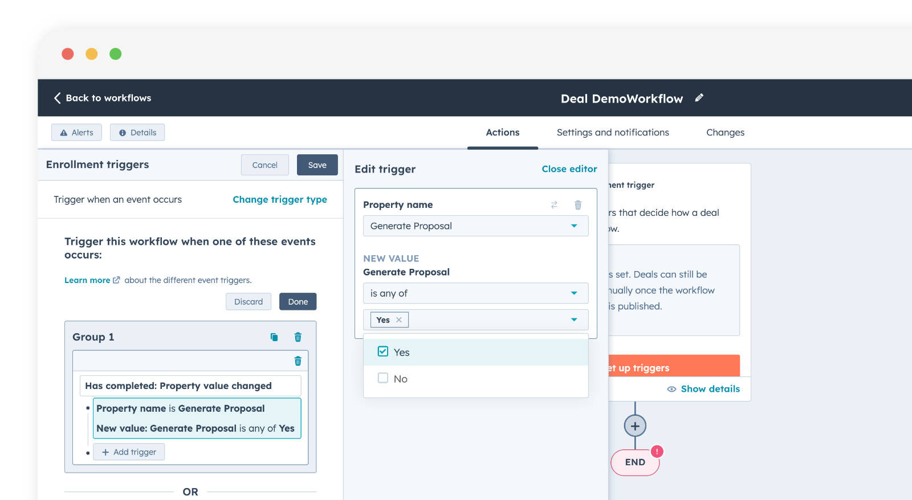

# Add a Portant Action to a HubSpot Workflow



HubSpot Workflows are a cornerstone for automating and streamlining business processes. This article will show you how to add a Portant Action to a HubSpot Workflow.

In this guide you will learn how to:

1. Set up a HubSpot Workflow.
2. Add a Portant action

If you want to learn more about HubSpot Workflows, the HubSpot Knowledge Base is a great place to start: [https://knowledge.hubspot.com/automation/topics#workflows](https://knowledge.hubspot.com/automation/topics#workflows)

> **Note** - If you are looking to trigger a HubSpot Workflow from a Portant Workflow we have a separate guide [here](trigger-hubspot-workflows-from-portant.md).

### How to create a HubSpot Workflow

There are many ways toCreate Workflows in HubSpot. To learn all about the different ways you can get started by reading the HubSpot Knowledge Base Article: [https://knowledge.hubspot.com/workflows/create-workflows](https://knowledge.hubspot.com/workflows/create-workflows)\
In this example we will create a basic workflow from scratch. To create a HubSpot workflow, in the top menu click **Automation** > **Workflows**

<figure><figcaption></figcaption></figure>

Then click '**Create workflow**'&#x20;

<figure><figcaption></figcaption></figure>

Then click '**From Scratch**'

<figure><figcaption></figcaption></figure>

The next step is to choose the HubSpot Object type to base your workflow on. You can select:

* **Contact-based** - triggered by fields in a HubSpot Contact
* **Company-based** - triggered by fields in a HubSpot Company
* **Deal-based** - triggered by fields in a HubSpot Deal
* **Ticket-based** - triggered by fields in a HubSpot Ticket

It is important to select the Object type that is the same as your [Primary Object in your Portant Workflow](./#select-your-hubspot-primary-object)

<figure><figcaption></figcaption></figure>

Then select how the workflow will be triggered. In this example we are going to trigger the workflow to start when a deal property names 'Generate Proposal' is set to 'Yes'. To start, click '**Set up triggers**'

<figure><figcaption></figcaption></figure>

‍Then click '**When an event occurs**'

<figure><figcaption></figcaption></figure>

Then select 'Property value changed'

<figure><figcaption></figcaption></figure>

In this example I am going to select when a custom property I have added called 'Generate Proposal' changes to 'Yes', like this:

<figure><figcaption></figcaption></figure>

Then click 'Save'

<figure><figcaption></figcaption></figure>

### Add a Portant Action

The next step is to add a Portant Action to your workflow. First of all click the '**+**' button below your workflow:

<figure><figcaption></figcaption></figure>

You will see Portant in the menu on the left side.

<figure><figcaption></figcaption></figure>

> **Note** - If you don't see Portant in this menu, it probably means you haven't installed [Portant with Super Admin permissions](how-to-install-the-portant-app-in-hubspot/#optional-permission-to-use-portant-actions-in-hubspot-workflows). Due to a bug in HubSpot, Super Admin permissions are required to enable apps to interface with HubSpot Workflows.

Then select to '**Run a Portant Workflow**'

<figure><figcaption></figcaption></figure>

Then you can select a Portant Workflow to run. The dropdown list will display all the Portant Workflows that have te same Primary Object as the trigger of the workflow.

<figure><figcaption></figcaption></figure>

Then click '**Save**' and you've added a Portant action to a HubSpot Workflow 🎉

<figure><figcaption></figcaption></figure>

Just click '**Review and publish**' to turn on your Workflow

<figure><figcaption></figcaption></figure>

There are a few options and settings to select at the review stage. For more info please check out this HubSpot Knowledge base article: [https://app.hubspot.com/academy/23509132/lessons/1002820/4254?\_ga=2.75058139.852478564.1707691517-664841247.1705550101\&rpid=2272014](https://app.hubspot.com/academy/23509132/lessons/1002820/4254?_ga=2.75058139.852478564.1707691517-664841247.1705550101\&rpid=2272014)

### When to use a Portant Action

Here are a few ideas of when to use the Portant Action to improve processes within your company:

* **Trigger documents from mobile:** Since there is no way to interact with an App integration on mobile, you can use this technique to trigger a document to be generated from the mobile view.&#x20;
* **Advanced Auto-create triggers:** within the Portant App you can only trigger workflows from Deal Stage.&#x20;
* **Auto-create for other object types:** This method enables you to set up documents to be automatically generated based off changes within other Object types, like Contacts, Companies or Tickets.

#### **Feedback and feature suggestions**

We created Portant in 2021, and the feedback we have received since then has been very helpful and greatly appreciated. If you have any feedback, please feel free to send us an email at contact@portant.co

Thanks,

Blake and James
