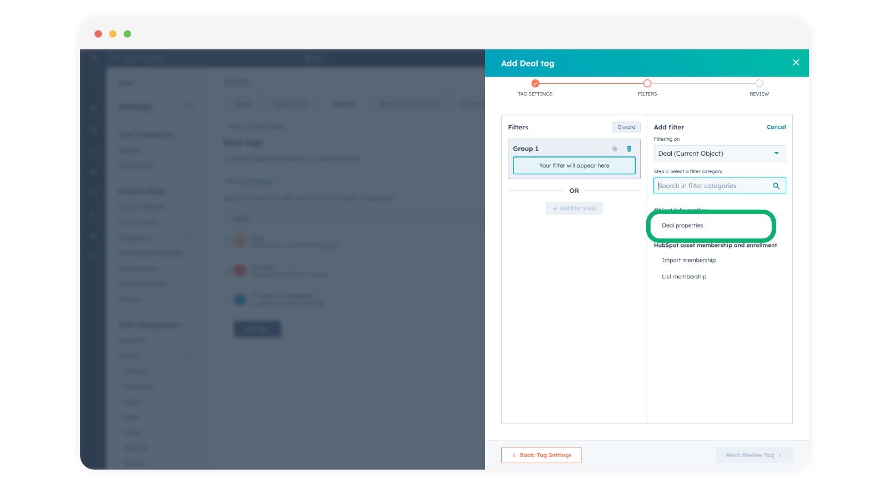

# Add Deal Tags using Portant document statuses

Deal Tags are a powerful tool to indicate key status of Deals and ensure that everyone is aware of the current status of each deal. This guide will provide step-by-step instructions to help you efficiently add and manage these tags which are triggered by Portant Document Statuses. For example, when a signature is requested, or when it is signed.

**In this article you will learn how to:**\
1\. Add a HubSpot Deal Tag

#### How to add a HubSpot Deal Tag

To add a HubSpot deal tag open Settings > Data Management > Objects > Deals

Then click on the Pipelines tab at the top of the page and select "**Manage deal tags**" here:

<figure><figcaption></figcaption></figure>

A new screen will open and then you can click Add Tag at the bottom:

<figure><figcaption></figcaption></figure>

Then, select to "**Create from scratch**"

<figure><figcaption></figcaption></figure>

You can name your tag whatever you want. In this example I am going to create a tag which is added when an agreement has been signed:

<figure><figcaption></figcaption></figure>

Then click "**Next: Add Filters**"

Filtering on = Deal (Current Object)

Step 1: Select a filter category = Deal Properties

<figure><figcaption></figcaption></figure>

Then scroll down to the bottom and select "**Document Status**". (You will find it in the "**Portant**" group of properties):

<figure><figcaption></figcaption></figure>

Then select when the Status is "**Signed**"

<figure><figcaption></figcaption></figure>

Then click "**Next: Review Tag**"

And finally click "**Save**"

<figure><figcaption></figcaption></figure>

Afteer you have completed these steps, you will see a Deal Tag added to any deal that has a document signed via Portant. It will look like this:

<figure><figcaption></figcaption></figure>

You can combine this with Automation to move the deal to a new stage when a status is

> You can also use the Document Status (Custom Property) to trigger HubSpot Workflows. e.g. To move a deal to a new stage when it has been signed. \
> You can learn how to implement a workflow like this in our [Trigger HubSpot Workflows from Portant](trigger-hubspot-workflows-from-portant.md) article.

#### Feedback and feature suggestions

We created Portant in 2021 and the feedback we have received since then has been very helpful and greatly appreciated. If you have any feedback please feel free to send us an email at contact@portant.co

Thanks,

Blake and James

\
\
\
