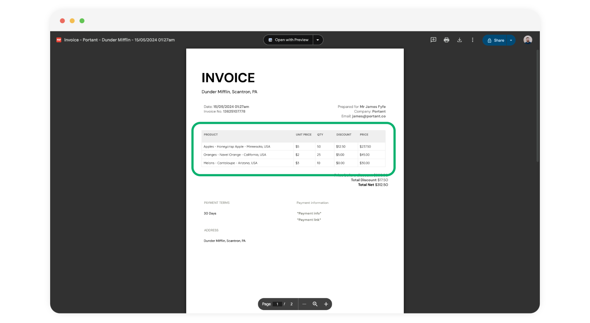

# Add multiple line items into a single document

Did you know you can add multiple connected object records into one document? For example, if you add multiple line items to a HubSpot deal, you can put them all in the same document within a table. Let's explore this together!

**In this article you will learn how to:**\
1\. Group multiple line items into a single file (works with all connected objects)

#### Group multiple line items into a single file

In this guide article we will jump straight to grouping multiple line items into a document. However, if this is your first time creating a workflow using HubSpot as a source, please refer to this [article](https://docs.portant.co/portant-docs/sources/hubspot#select-hubspot-as-your-workflow-source).

Once you have set up your workflow, open your template block (Google Docs or Slides):\

<figure><figcaption></figcaption></figure>

To add multiple objects into a document, the object tags need to be placed in a table. Then Portant will extend the table and add all the objects to the table, like this:

<figure><figcaption></figcaption></figure>

Then, ensure to insert all tags within a table. For instance, in this scenario, we're employing a table with tags for Line Item Name, Line Item Unit Price, and Line Item Quantity.

<figure><figcaption></figcaption></figure>

When running your workflow from a deal with multiple tags, Portant App seamlessly consolidates them into the same document by generating additional lines within the existing table.\

<figure><figcaption></figcaption></figure>

#### Feedback and feature suggestions

We created Portant in 2021 and the feedback we have received since then has been very helpful and greatly appreciated. If you have any feedback please feel free to send us an email at contact@portant.co

Thanks,

Blake and James

\
\
\
