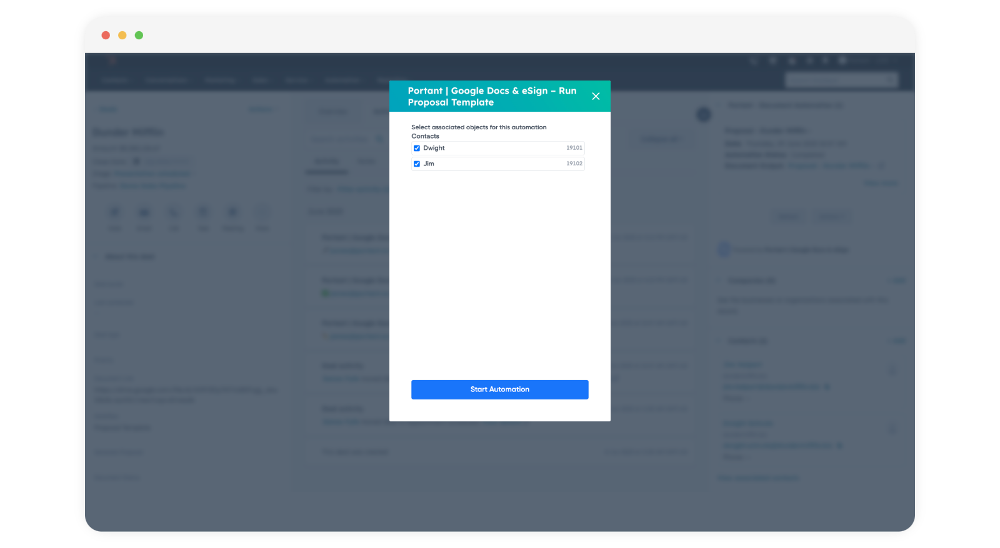

# Create a document in HubSpot

If you already have a Portant Workflow set up, you can generate a document directly from HubSpot

To generate a document, navigate to HubSpot and open a Deal, Contact, Company or Ticket Page.&#x20;

**Open HubSpot > Open a Deal/Contact/Company/Ticket**

Then Portant will appear in the right panel, here:

<figure><figcaption>
Portant's CRM Card
</figcaption></figure>

Each Portant Workflow is connected to one HubSpot Object, so if you workflow doesn't appear in the actions list, please check you are using the correct Primary Object (Deal, Contact, Company or Ticket)

To generate a document. Click Actions and then click your workflow name

<figure><figcaption></figcaption></figure>

> **Note** - If you workflow doesn't appear in the list make sure you are looking at the right Primary object in HubSpot. Portant workflows will only appear on the [Primary Object page selected in the source in Portant](create-a-document-in-hubspot.md#select-your-hubspot-primary-object)

After you select the Workflow name a modal will appear where you can start the automation. In this modal you can select the associated objects to be included in the document. For example, if you have multiple contacts you can select the contact to use in the document:

<figure><figcaption></figcaption></figure>

This will start the document generation process. It will take a few seconds to generate the document. Please refresh your page, and you will see the document link appear in the side bar above the action button. The same document will also be saved in a new folder created in your Google Drive.

Portant also saves the document details to a set of Custom HubSpot Properties on the Deal/Contact/Company/Ticket Object. These properties can be used to trigger [HubSpot Workflows](https://knowledge.hubspot.com/workflows/create-workflows). You can learn [how to set up a HubSpot workflow triggered from a Portant action in this article](trigger-hubspot-workflows-from-portant.md).

That's all there is to it, you've just generated a document automatically using Portant.

### **Feedback and feature suggestions**

We created Portant in 2021, and the feedback we have received since then has been very helpful and greatly appreciated. If you have any feedback, please feel free to send us an email at contact@portant.co

Thanks,

Blake and James
