# How to install the Portant App in HubSpot

To install the Portant app in HubSpot navigate to [this page](https://ecosystem.hubspot.com/marketplace/apps/sales/sales-enablement/portant-hubspot-google-docs-integration) and click the 'Install app' button here:

<figure>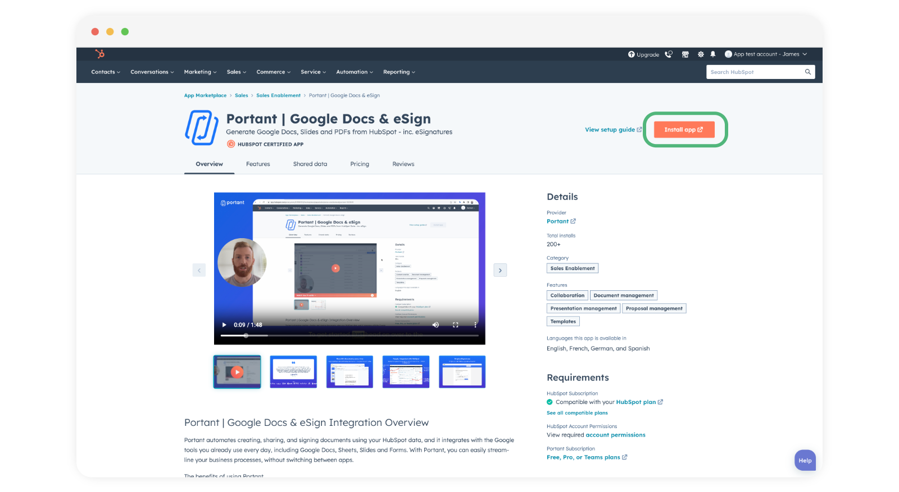<figcaption>
<a href="https://ecosystem.hubspot.com/marketplace/apps/sales/sales-enablement/portant-hubspot-google-docs-integration">https://ecosystem.hubspot.com/marketplace/apps/sales/sales-enablement/portant-hubspot-google-docs-integration</a>
</figcaption></figure>

After you have installed the Portant app you can [create your first Workflow in Portant and generate your first document.](../create-a-document-in-hubspot.md)

### Mandatory HubSpot User Permissions to install Portant in HubSpot

When you install the Portant App, you need to make sure you have all the permissions to do so. If you don't you may be prevented from installing the app. Here is a list of the permissions needed to install the Portant app:

1. **App Marketplace Access -** This permission allows users to install third party applications. This is required to install Portant.

<figure>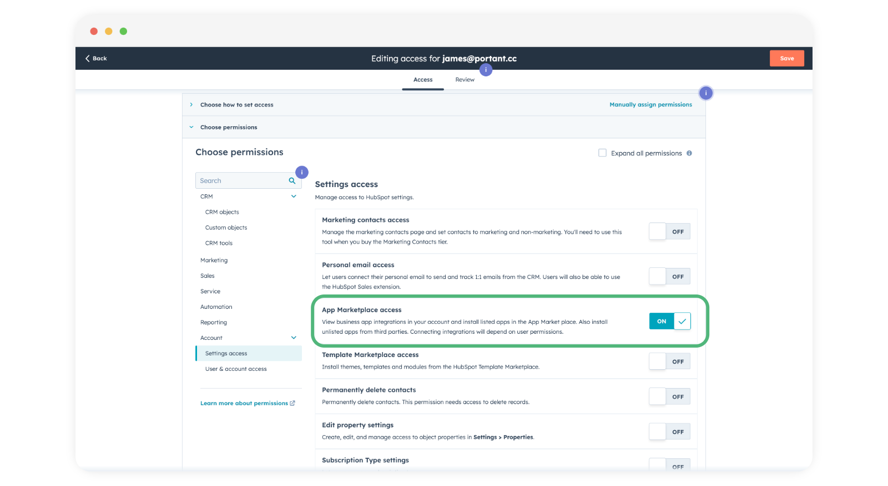<figcaption></figcaption></figure>

2. **CRM Objects** - These permissions provide access to the resources within HubSpot.\
   View permissions (Read) are used by Portant to fetch automation data.\
   Edit permissions (Write) are used by Portant to store output document data on the related object used within the automation

<figure>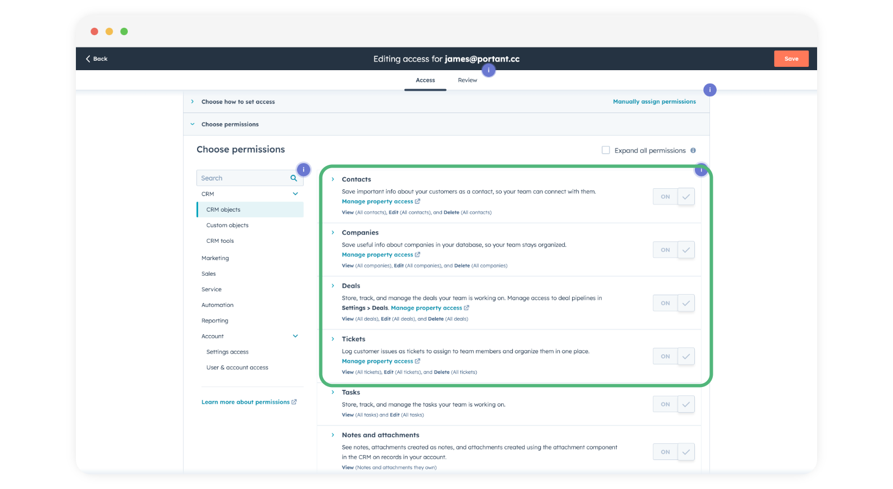<figcaption></figcaption></figure>

3. **Custom Properties \[Optional] -** This permission allows users to create and edit custom properties on existing HubSpot objects. Portant uses this permission to create custom properties on existing objects to store output document data such as statuses and links.

<figure>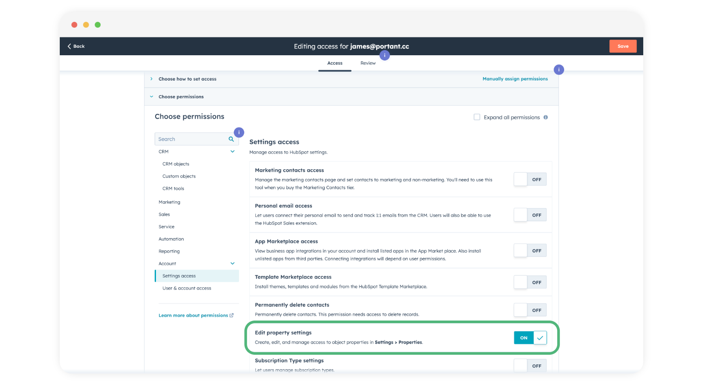<figcaption>
Open the Settings access menu then turn on 'Edit property settings'
</figcaption></figure>

4. **Contact Lists** - This permission allows users to access lists of contacts. Portant uses this scope only in the Portant Workflow interface to allow users to run automations directly on an entire list of contacts. Only “View” access is required for Portant to access contact lists.

<figure><figcaption>
Open the Marketing menu then turn on 'Lists'
</figcaption></figure>

5. **HubSpot Users Information \[Optional]** - This permission allows users to fetch data about other users in their HubSpot account. Portant uses this data to convert user IDs to human readable data (e.g. names/emails). This is often used in the context of the “owner” of a resource such as a deal.

<figure>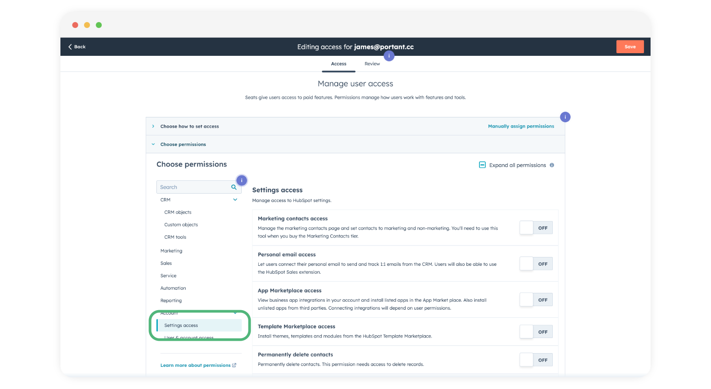<figcaption>
Open the Settings access menu
</figcaption></figure>

<figure>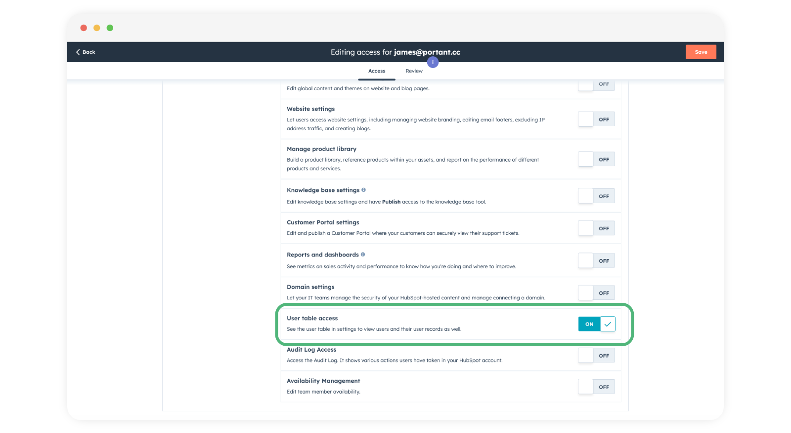<figcaption>
Then turn on 'User table access'
</figcaption></figure>

### \[Optional Permission] if you use HubSpot Custom Objects

> **Note** -  you only need to add this permission if you have added[ Custom Objects](https://knowledge.hubspot.com/records/use-custom-objects) to you HubSpot Account. (Custom Objects are only available in the Enterprise HubSpot subscriptions)

This permission allows users to view custom objects in HubSpot. Portant uses this permission to fetch data of custom objects when they are associated with a primary object that is used within an automation. Only view access is required for Portant to fetch this data. In the example below “Ducks” is an example of a custom object. 🦆

<figure><figcaption></figcaption></figure>

### \[Optional Permission] to save output PDFs as attachments in HubSpot &#x20;

Portant can automatically save any generated PDFs as attachments. To do so you need to grant access to the Notes permission, here:

<figure>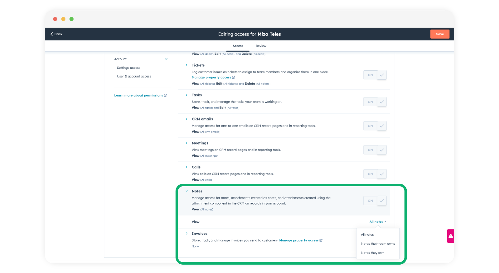<figcaption></figcaption></figure>

### \[Optional Permission] to use Portant Actions in HubSpot Workflows&#x20;

Portant can be a Connected app in Hubspot Workflows, which means you can run a Portant Workflow as an action within a HubSpot Workflow like this:

<figure>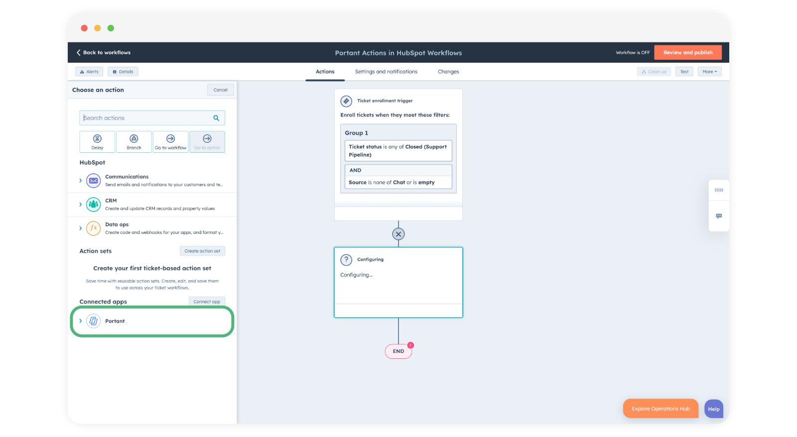<figcaption></figcaption></figure>

Despite their being a granular permission that allows users to set up automations within their HubSpot account we have discovered that “Super Admin” is required once the “automation” scope is used.&#x20;

For this reason we have made this an optional permission.

> **Note** - After you have made the user a Super Admin they will be able to use Portant Automation Actions. But then you can revert the permission and the user will **still be able to use** the Automation actions.&#x20;

### How to disconnect HubSpot from Portant

Please follow these steps to disconnect HubSpot from Portant:

* Navigate to this page: https://app.portant.co/settings/permissions
* Click on the Manage button next to HubSpot
* Then click 'Disconnect' as shown below

<figure>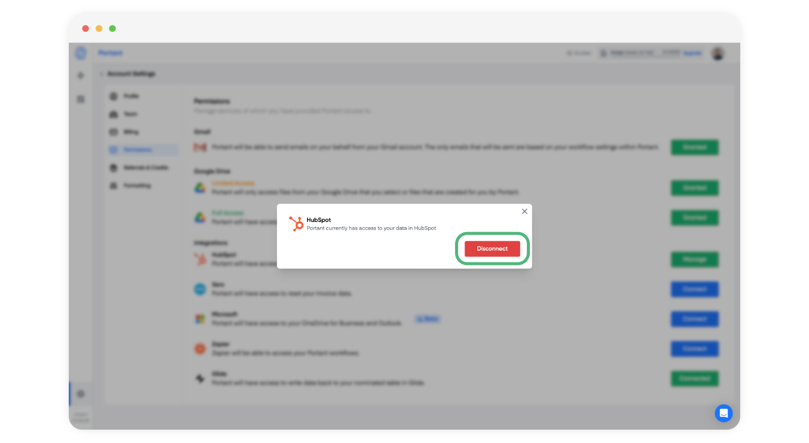<figcaption></figcaption></figure>

* After you have done this, your account will be disconnected.

If you would then like to uninstall Portant from your HubSpot account, please follow these steps

* Navigate to the HubSpot App Marketplace.
* Then click Manage apps here:

<figure>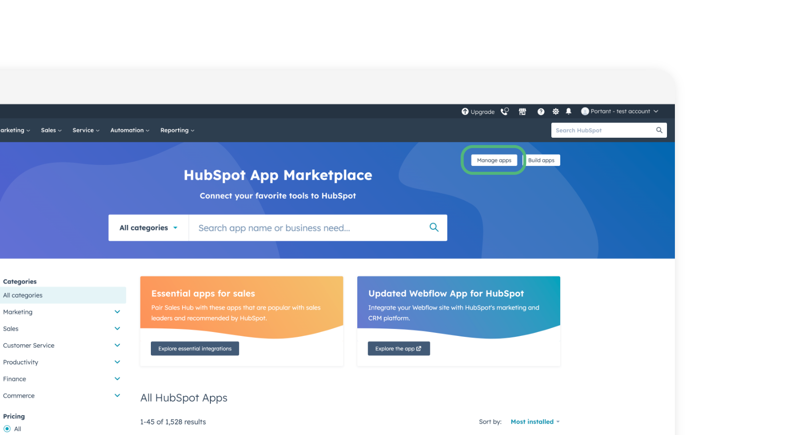<figcaption></figcaption></figure>

* Then click the Actions button under Portant and then Uninstall

<figure>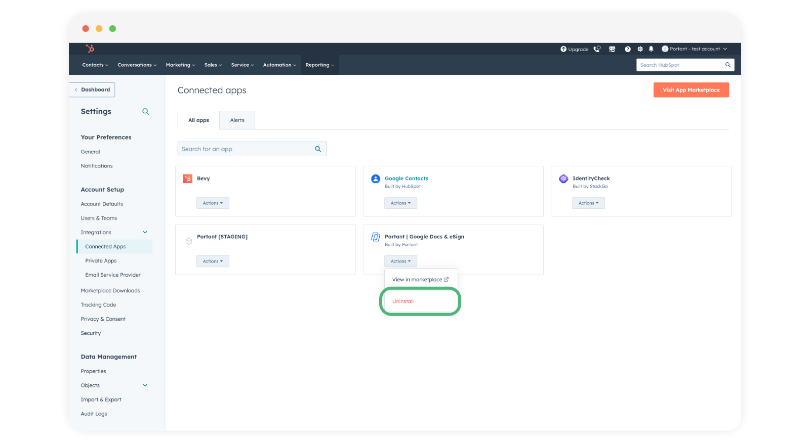<figcaption></figcaption></figure>

* After you have completed this, the Portant App will be removed from your HubSpot account. This will not remove any data from your Portant account, or documents from your Google Drive.
* If you would like to completely remove all your data from Portant and delete your account, please send a data deletion request to this email contact@portant.co, and your data will be deleted within two business days.

If you have any other questions about data and how Portant manages it, please email contact@portant.co 😀

#### Feedback and feature suggestions

We created Portant in 2021, and the feedback we have received since then has been very helpful and greatly appreciated. If you have any feedback, please feel free to send us an email at [contact@portant.co](mailto:contact@portant.co)\

\
