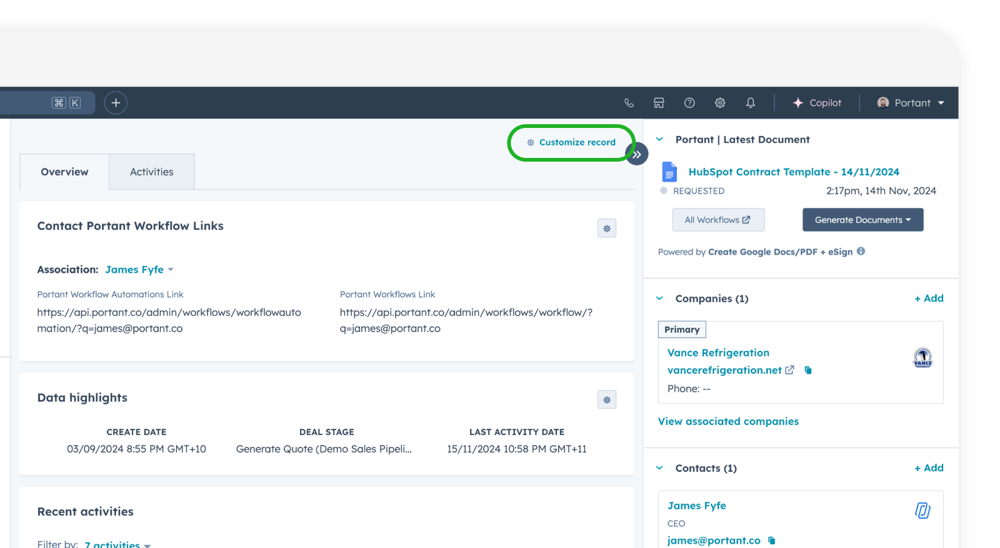
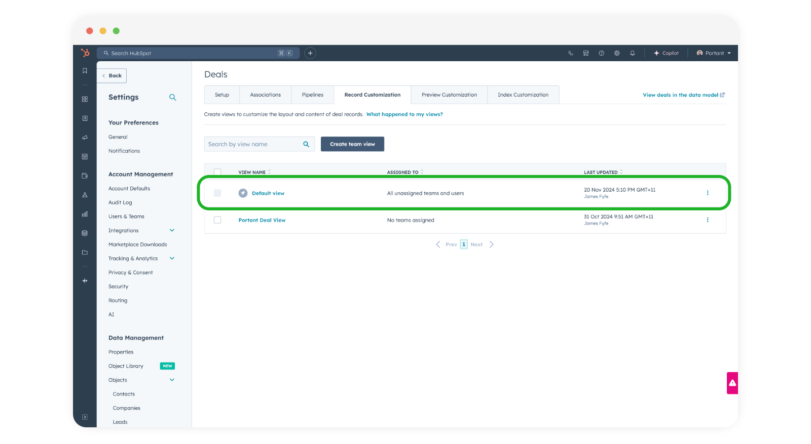
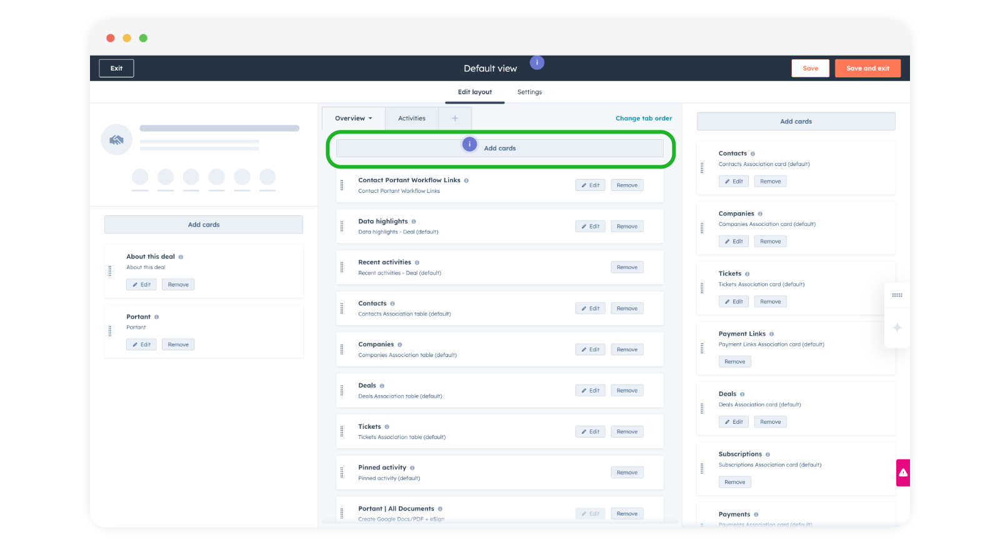
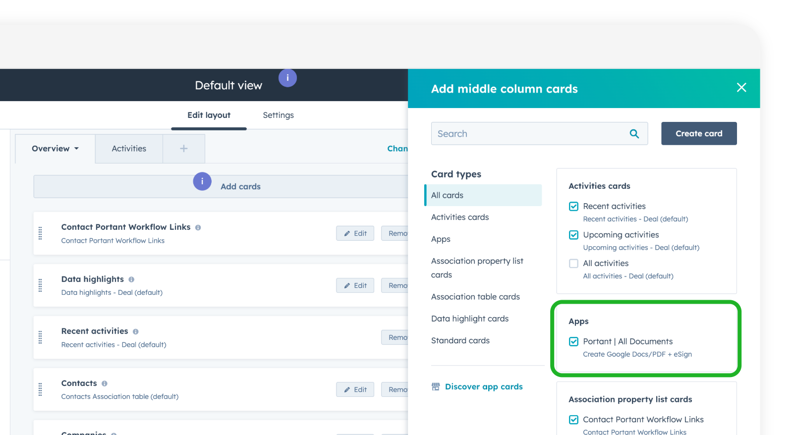
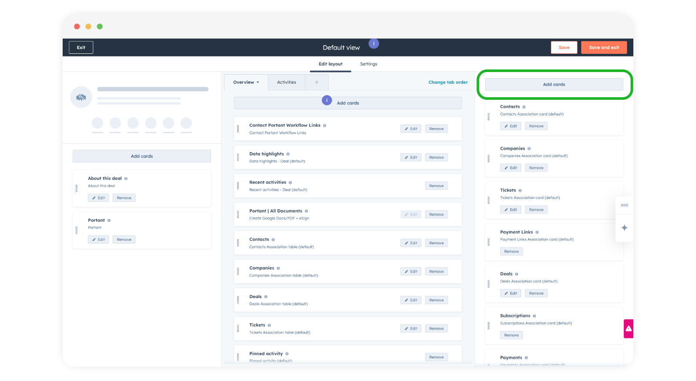
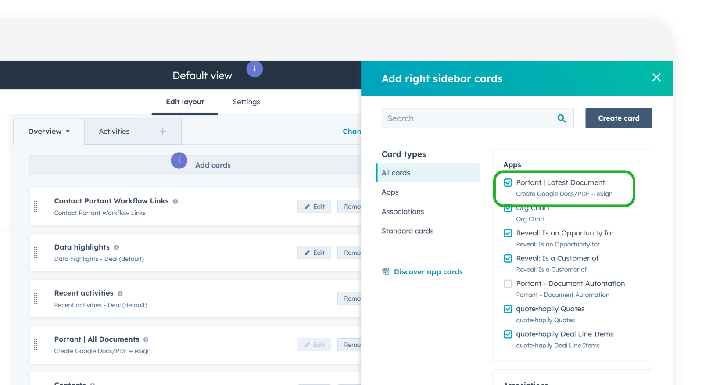
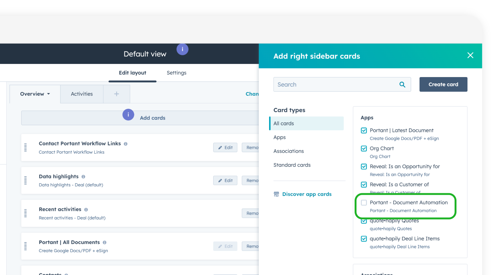
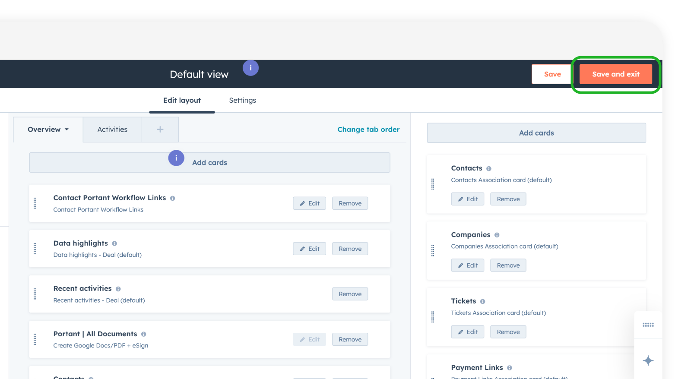
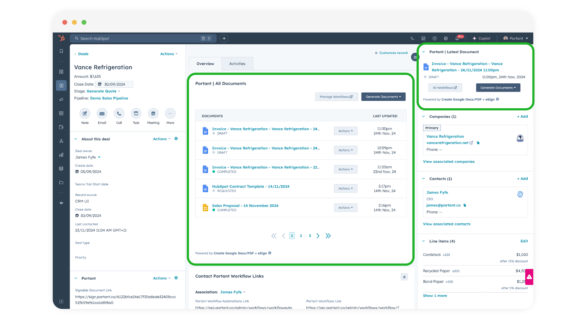

# How to Add Portant App Cards to HubSpot



After you have [installed the Portant App in HubSpot](./) you can now customise how the app appears in your HubSpot Portal using App Cards.\
\
Portant App Cards put actionable information right where you need it—on your HubSpot records. By embedding Portant deeper into HubSpot, you’ll enjoy a seamless experience that eliminates context-switching and enhances productivity.\
\

### How to add App Cards to HubSpot

**Access the Record Customization Options**

* Navigate to the record you wish to customize (e.g., contact, company, deal, etc.).
* Click the **Customize Record** button, typically found in the top-right corner of the record view.

<figure><figcaption></figcaption></figure>

**Select the Appropriate View**

* Choose the default view or a specific view to which you want to add the app card.
* Click on the desired view to enter its customization settings.

<figure><figcaption></figcaption></figure>

**Add App Cards**

* In the customization menu, click on the **Add Cards** option.

<figure><figcaption></figcaption></figure>

* Use the filter option to narrow down the cards by app integrations if necessary.
* Locate the "Portant All Documents" App Card in the list.
* Select the checkbox next to the app card to add it to the record view.

<figure><figcaption></figcaption></figure>

**Position the App Card**

* Scroll to the bottom of the list to find the newly added app card.
* Drag and drop the card to your desired position within the record view.

<figure><figcaption></figcaption></figure>

**Customize the Right-Hand Sidebar (if applicable)**

* You can repeat the process for the right-hand sidebar by selecting the **Add Cards** option there.
* Filter and select the desired app cards, and position them as needed.

<figure><figcaption></figcaption></figure>

* Locate the "Portant Latest Documents" App Card in the list and select it

<figure><figcaption></figcaption></figure>

**Remove the Old Portant CRM Cards (optional)**

* You can remove the Old CRM card called "Portant - Document Automation" if you no longer need it.

<figure><figcaption></figcaption></figure>

**Save and Exit**

* After making all changes, click **Save and Exit** to finalize your updates.

<figure><figcaption></figcaption></figure>

**Verify the Changes**

* Return to the record view to ensure that the new app card(s) are correctly displayed and the old CRM card (if removed) is no longer visible.
* Adjust the placement or visibility of the app card if necessary.

<figure><figcaption></figcaption></figure>


For more information on how to customise HubSpot records please visit [HubSpot's Customize Records Knowledge article ](https://knowledge.hubspot.com/object-settings/customize-records)


By following these steps, you will successfully add and customize app cards in your HubSpot record views.

\
