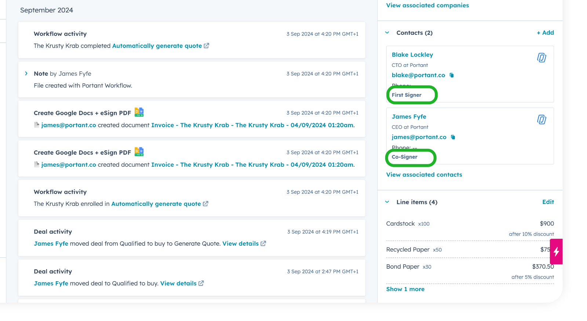

# How to manage and select HubSpot Properties

Did you know that you can conveniently handle all HubSpot fields using the Portant App and view a complete list of potential fields for your workflow? Moreover, you can seamlessly incorporate custom properties from your HubSpot account. 😀

**In this article you will learn:**

1. How to manage and select HubSpot properties within Portant
2. How to use "Labeled Contact Tags" within a template

### **How to manage and select HubSpot properties within Portant**

This guide dives directly into the management of HubSpot fields through a workflow. If it's your initial experience integrating HubSpot as a source with the Portant App, you may find valuable information in this accompanying [article](https://www.portant.co/guide-article/how-to-connect-a-hubspot-data-source).

Initiate the process by navigating to the Source Block within your workflow and selecting the "Manage HubSpot Fields" option:

<figure><figcaption></figcaption></figure>

Following that, a board will be displayed, presenting all the objects originating from your HubSpot account:

<figure><figcaption></figcaption></figure>

Select the dropdown button to unveil the properties associated with each object:

<figure><figcaption></figcaption></figure>

Note that you have the option to exclusively display properties for the selected objects if you prefer:\

<figure><figcaption></figcaption></figure>

Once you have chosen or deselected the properties for the desired object, just click "Save," and you're good to go!

### Inserting data from Labeled Contacts (or any [Associated Object](https://knowledge.hubspot.com/object-settings/create-and-use-association-labels))


You can use Association Labels for any connected objects in HubSpot


If you have multiple contacts associated with your Primary object, you can utilize labeled contact tags. These tags help you easily identify and organize which contact's properties you would like to place within your templates. For detailed instructions on creating and using association labels, refer to this HubSpot guide:[ Create and use association labels](https://knowledge.hubspot.com/object-settings/create-and-use-association-labels).

<figure><figcaption>
How to add an "association label" to a contact
</figcaption></figure>

To include the names of your labeled contacts in your documents, you can use tags like \{{**Label:** Contact First Name\}} (where **Label** is the name of the [Association Label](https://knowledge.hubspot.com/object-settings/create-and-use-association-labels)) If you also want to include their last name, use the tag \{{Label: Contact Last Name\}}.&#x20;


**Warning -**  The tag must contain a space after the colon and before property name. e.g. \
❌ \{{**Label:**&#x43;ontact Last Name\}} (no space)

✅ \{{**Label:** Contact Last Name\}} (space after colon)


For instance, if your contacts are labeled as "First Signer" and "Co-Signer," the corresponding tags would be:

\{{First Signer: Contact First Name\}} \{{First Signer: Contact Last Name\}}

\{{Co-Signer: Contact First Name\}} \{{Co-Signer: Contact Last Name\}}

<figure><figcaption>
Where the Association-labels appear on contacts
</figcaption></figure>

#### Feedback and feature suggestions

We created Portant in 2021 and the feedback we have received since then has been very helpful and greatly appreciated. If you have any feedback please feel free to send us an email at contact@portant.co

Thanks,

Blake and James
