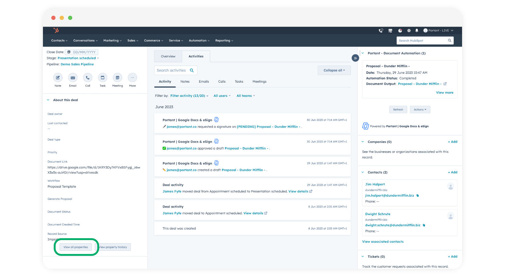
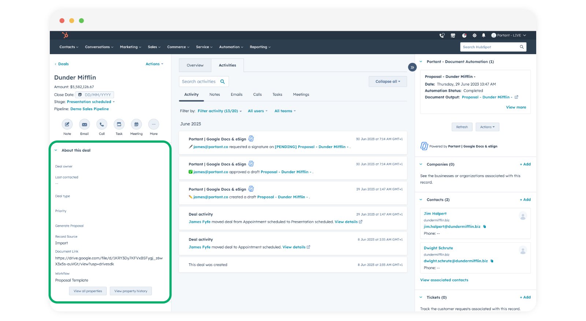
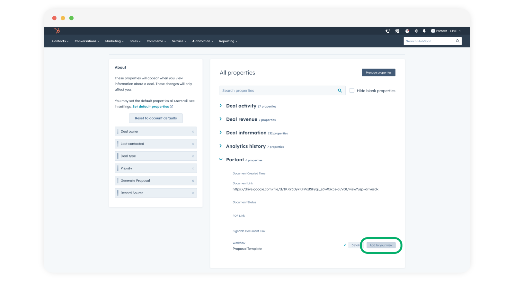

# How to view created documents in HubSpot

Sometimes, you may require more precise tracking of the number of documents created within a specific HubSpot automation. The good news is, there are several ways to achieve this. Let's explore all options!! 🙌\
\
In this article you will learn how to:

1. View created documents in the CRM Card
2. View created documents in the Activity Section
3. View created documents in the custom Properties
4. View created documents in the Attachments Section

**View created documents in the CRM Card**

The CRM card on a deal provides a summary of key details and actions related to that deal, such as deal stage, amount, close date, and next steps. It helps users quickly assess and manage deal progress. Also, within your CRM card, you'll find a Portant Card for running workflows directly within your HubSpot account and viewing your created documents. This card will appear automatically in your CRM once you've installed the Portant App. The installation process is straightforward; refer to this [LINK](https://docs.portant.co/portant-docs/sources/hubspot) to learn more.

<figure><figcaption></figcaption></figure>

#### View created documents in the Activity Section

&#x20;

The Activity Feed on a deal shows a timeline of interactions related to that deal, including emails, calls, meetings, and notes. It helps track the progress and communication history for that specific deal.\

Open a deal and click the "Activities" tab:

<figure><figcaption></figcaption></figure>

Click "Filter Activity" and select "Portant | Google Docs & eSign" from the options:

<figure><figcaption></figcaption></figure>

<figure><figcaption></figcaption></figure>

Now you can see document creation activities related to the deal:

<figure><figcaption></figcaption></figure>

#### View created documents in the custom Properties

HubSpot custom properties on a deal allow you to track and store additional information specific to your business or process, enhancing the deal's context and relevance. Portant stores document details on a group of custom properties we add to your deal/contact/company/ticket. You can view them here:

<figure><figcaption></figcaption></figure>

> **Note** | You can use these custom properties to [trigger HubSpot Workflows](trigger-hubspot-workflows-from-portant.md) or create dashboards or reports

You can also add these properties to the left hand menu here:

<figure><figcaption></figcaption></figure>

To add them, click the view all properties button here:

<figure><figcaption></figcaption></figure>

Then scroll down to the group of Portant Custom Properties, and click 'Add to your view' to add them to the overview on the left hand side of your page.

<figure><figcaption></figcaption></figure>

After you have selected the properties you wan to add, you can navigate back to the deal/contact/company/ticket and the selected properties will now appear on the left hand side.\

\
**View created documents in the Attachments Section**

The attachments section in HubSpot permits users to upload and store pertinent files or documents linked to specific records, such as contacts or deals. Moreover, PDF outputs generated by Portant are automatically saved in this section.

To access the PDF output generated by Portant, navigate to the Attachments Section in HubSpot and click the dropdown button.

<figure><figcaption></figcaption></figure>

After clicking the dropdown button, you'll be able to view the attached PDF. If there are multiple attachments in this section, simply click "View all attachments" to see them all.

<figure><figcaption></figcaption></figure>

Next, you will see all available attachments in this section.\

<figure><figcaption></figcaption></figure>

Note that here, you have the option to search for attachments using the search bar, as demonstrated below.

<figure><figcaption></figcaption></figure>

To delete any file, simply select it by marking the checkbox and then click "Remove."

<figure><figcaption></figcaption></figure>

\
To confirm the action, simply click "Detach."

<figure><figcaption></figcaption></figure>

\

**Feedback and feature suggestions**

We created Portant in 2021 and the feedback we have received since then has been very helpful and greatly appreciated. If you have any feedback please feel free to send us an email at contact@portant.co

Thanks,

Blake and James

\
