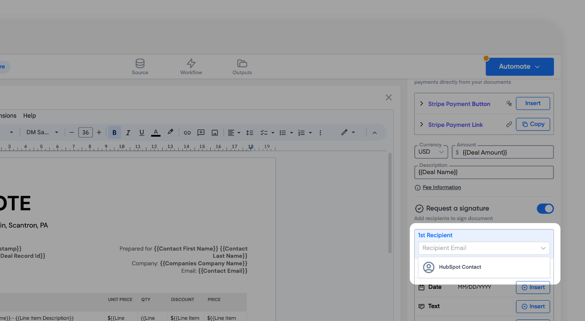
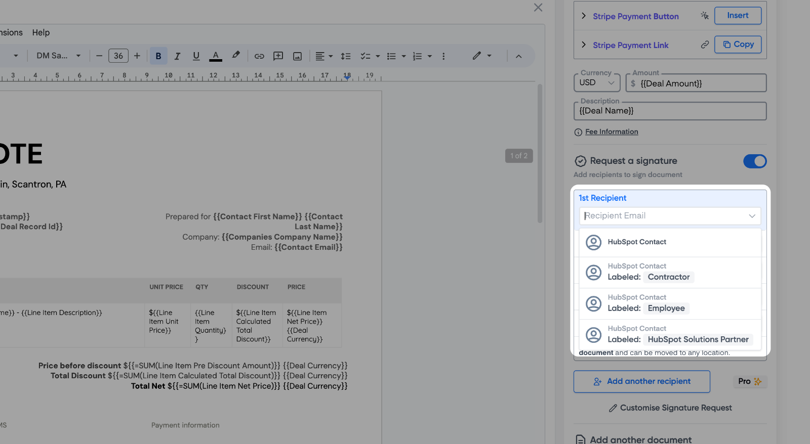
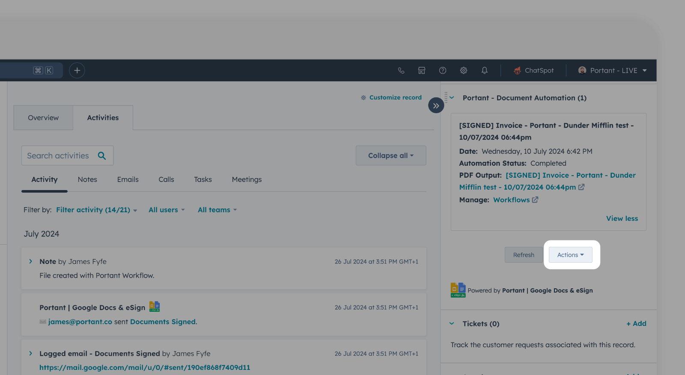
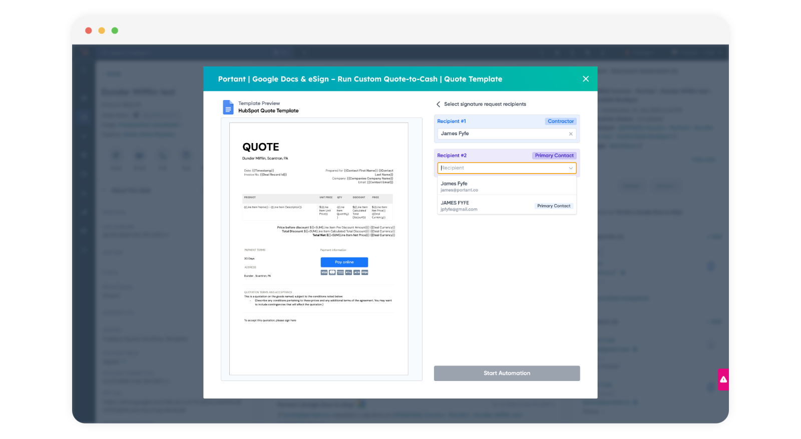

# Portant eSignatures + HubSpot


This is a guide on the specifics of how to set up eSignatures with HubSpot. For details on how to set up eSignatures with Portant please visit [**this section**](broken-reference)**.**


In this guide we will go over how to add eSignature placeholders to a Portant Workflow with HubSpot as the source. We will cover the following areas:

1. How to select a **HubSpot Contact** as the recipient
2. How selecting a HubSpot Contact as a recipient works

### How to select a **HubSpot Contact** as the recipient

Below the Output Name field there is a button to "Request a Signature" as part of your workflow.

<figure><figcaption></figcaption></figure>

When you click this button some additional Signature settings will appear below it. There are three main parts;

1. The email address of the recipient - this can either be a \{{tag\}} from your source, you can type an email (e.g. james@portant.co) [**OR it can also be a HubSpot Contact**](portant-esignatures-+-hubspot.md#selecting-a-hubspot-contact-as-the-esignature-recipient)**.**
2. The Signature placeholder - this inserts a placeholder image into your document so you can specify where the signature is inserted
3. The Date placeholder - this inserts a placeholder image into your document so you can specify where the date the document was signed is inserted
4. A text field - to collect additional information at the signing stage (e.g. entering a delivery address)
5. A Checkbox field - to collect additional information at the signing stage (e.g. Accepting terms and conditions or selecting a specific product.)


Form more details about Parts 2-5, please visit our [full guide on eSignatures here](broken-reference)


#### Selecting a HubSpot Contact as the eSignature recipient

When you select the recipient as a HubSpot contact, Portant will ask the user which contact associated with the Deal/Ticket/Company they'd like to be the recipient.&#x20;

<figure><figcaption></figcaption></figure>

#### Using HubSpot Contact Association Labels

Contact Association Labels are displayed in Portant when set up in HubSpot, like this:

<figure><figcaption></figcaption></figure>

This is a great way to identify different roles in the signed document and who should sign which part of the document. You can learn more about creating and using association labels in HubSpot by reading this [article](https://knowledge.hubspot.com/object-settings/create-and-use-association-labels).

You can still use the generic HubSpot Contact Property (without a label).

### How selecting a HubSpot Contact as a recipient works

When you have set up your workflow you can test your workflow in HubSpot. Manually run the workflow by opening the **Deal > Portant CRM Card > Actions > Select your Workflow**

<figure><figcaption></figcaption></figure>

Then, you can select one of the contacts associated for the deal for each recipient in the document. The preview of the document on the left allows you to see where the signatures will be placed. If you selected labeled contacts, the recipient will also have a label to help the user to select the right contact.

<figure><figcaption></figcaption></figure>

By default the first contact for each labeled contact will be pre selected. However, this can be overridden.


If you run a Portant workflow automatically, Portant will automatically select the first contact for each label.


Voila! You've just created your first signature workflow 🎉

#### Feedback and feature suggestions

We created Portant in 2021 and the feedback we have received since then has been very helpful and greatly appreciated. If you have any feedback please feel free to send us an email at [contact@portant.co](mailto:contact@portant.co)
