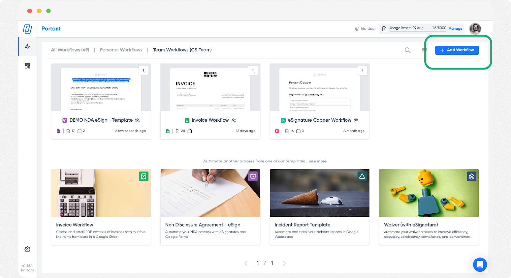

# Typeform

Portant simplifies your workflow by automatically generating documents directly from Typeform submissions. This seamless process is fully automated, making document generation quick and easy.

In this article you will learn how to:

1. Create a workflow using Typeform as a source
2. Connect Portant to Typeform
3. Edit a Typeform source workflow

### Create a workflow using Typeform as a source

Click the "+ Add Workflow" button.

<figure><figcaption></figcaption></figure>

Select Webhooks as your source.

<figure><figcaption></figcaption></figure>

#### Generate your webhook address

After you have selected a webhook as the source, Portant will automatically generate a unique webhook address:

<figure><figcaption></figcaption></figure>

### Add the webhook Address to Typeform

Copy this address to your clipboard and then open your application's webhook section and paste the link in the webhook field.\

**1.** Open your typeform from your Workspace.

**2.** Go to the **Connect** panel and click on the **Webhooks** tab.

**3.** Click **Add a webhook**.

<figure><figcaption></figcaption></figure>

**4.** Enter the **Destination URL** ([saved to your clipboard earlier](typeform.md#generate-your-webhook-address)). This is where we will make HTTP POST requests. Then click **Save webhook**.

**5.** You’ll be taken back to the webhooks tab. By default, your new webhook will be set to **Off** until you turn it on by clicking the toggle.

**6.** To test your webhook, click the **View deliveries** button, followed by the **Send test request** button that appears.

You can see your delivery IDs on the left. All test deliveries are marked **Test**.\
Click **Request** or **Response** to view requests or responses.

**Warning**! If you want to redeliver the test, make sure your webhook is set to **On**.&#x20;

**7.** Click the **X** in the top right corner to return to the Webhooks tab.

**8.** To edit your webhook, click the **Edit** button next to it.

**9.** A new window will appear where you can edit the **Endpoint URL**, add a **Secret**, toggle on **SSL verification**, select your **Trigger** (completed response or complete and [partial responses](https://typeform.zendesk.com/hc/en-us/articles/21102221958676)), and **delete** your webhook.

If you choose to delete the webhook, a warning message will appear to double check if you want to do this.

**10.** When you’ve finished editing your webhook, click **Save changes** to return to the webhooks tab.

> **Note! Typeform store deliveries of webhooks for 30 days.**
>
> If your webhook experiences errors, it may be deactivated by the Typeform team. If this happens, you'll get an email notification from Typeform so that you can review your webhooks and take any necessary action.&#x20;

If you've set up your webhooks already and are experiencing some issues, [this](https://www.typeform.com/help/a/webhooks-troubleshooting-and-faq-12978390412692/) FAQ and troubleshooting guide might be able to fix them.

#### Verify a test submission

After you have created a test submission, Portant's webhook block will look like this (with submissions on the left and the fields on the right)

<figure><figcaption></figcaption></figure>

#### Format your document

You can now add a document/presentation/email block to your workflow and use the fields captured in the webhook to customise the document.

<figure><figcaption></figcaption></figure>

### Finish your workflow

After you've set up the rest of your workflow, we recommend sending one more test to ensure if it is all formatted correctly.

Then when the workflow is live, you will be able to see webhook submissions in the webhook block and expand the submission to see the data:

<figure><figcaption></figcaption></figure>

The created output documents will be displayed in your output tab and saved in a Google Drive folder:

<figure><figcaption></figcaption></figure>

That's all there is to it, you've just set up a document workflow using a webhook as a data source.

#### Feedback and feature suggestions

We created Portant in 2021, and the feedback we have received since then has been very helpful and greatly appreciated. If you have any feedback, please feel free to send us an email at [contact@portant.co](mailto:contact@portant.co)\

