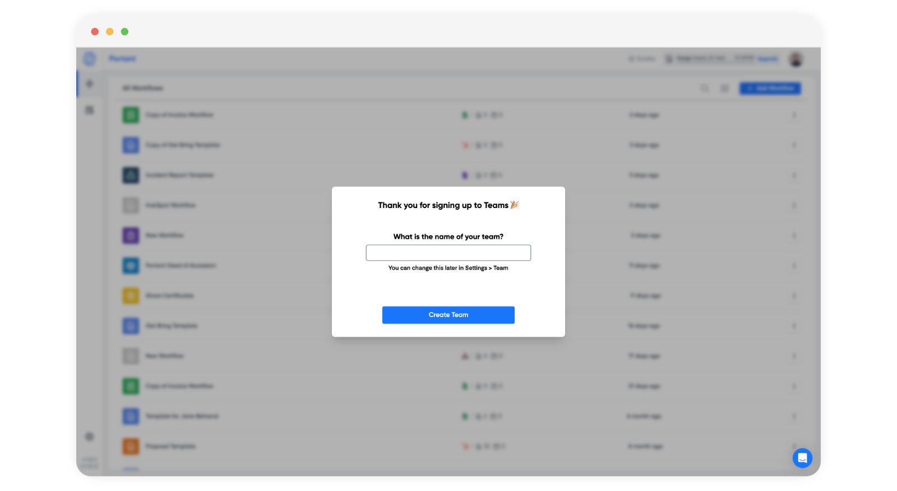

# Creating Your Team

This article will show you how to set up your team after signing up to the Teams plan.&#x20;

1. Naming your team
2. Inviting team members
3. Managing your team
4. Team document quota

#### Naming your team

When you first sign up for Teams you will be asked to name your team when you next log into Portant.

<figure><figcaption></figcaption></figure>

Enter your team name and then click the 'Create Team' button.

> The name of the team can be changed at any time

After you have named your team you will be taken to the [team management page](https://app.portant.co/settings/team), which looks like this:

<figure><figcaption></figcaption></figure>

You can edit your team name at any time by clicking the pencil icon next to your team name

#### **Invite a team member**

To invite someone to your team click the blue 'Invite' button in the top right of the page here:

<figure><figcaption></figcaption></figure>

After you've clicked this button you can add the email address of the person you want to add to your team. You can also pick the role of the person.

<figure><figcaption></figcaption></figure>

> The invited person doesn't need to have an account with Portant.

Learn more about [team permissions.](managing-team-permissions.md)

#### Managing your team

After you have added someone to your team you can see their:

* Linked accounts (e.g. Google Drive, Gmail, HubSpot etc)
* Date last logged in
* Usage quota

#### Team Document Quota

You document quota is shared between all members of your team. To view an individulas usage you can visit the team page and view the total usage for the period and each individual members usage for the period too.

#### **Feedback and feature suggestions**

We created Portant in 2021, and the feedback we have received since then has been very helpful and greatly appreciated. If you have any feedback, please feel free to send us an email at contact@portant.co
