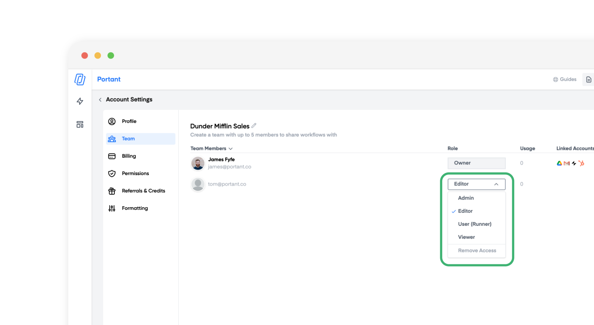

# Managing team permissions



The Portant Team plan has a few different roles that you can use to manage your team and keep your workflows running smoothly.

In this article you will learn

1. The different roles and what they do
2. How to change a team members role

### The different team roles and what they do

There are 5 different roles that can be present within a team. The first role, the team owner, is set by whomever purchased the Portant Teams plan. The other roles can be given to any team member that joins the Owners team.

> Please contact support to change the team owner.

Here is a list of what the different roles are able to do:

<table data-header-hidden data-full-width="false"><thead><tr><th width="105">Role</th><th width="129" align="center">Manage Billing</th><th width="124" align="center">Manage Users</th><th width="152" align="center">Create Workflow</th><th width="112" align="center">Run Workflow</th><th align="center">View Workflow</th></tr></thead><tbody><tr><td></td><td align="center"><strong>Manage Billing</strong></td><td align="center"><strong>Manage Users</strong></td><td align="center"><strong>Create Workflow</strong></td><td align="center"><strong>Run Workflow</strong></td><td align="center"><strong>View Workflow</strong></td></tr><tr><td><strong>Owner</strong></td><td align="center">✅</td><td align="center">✅</td><td align="center">✅</td><td align="center">✅</td><td align="center">✅</td></tr><tr><td><strong>Admin</strong></td><td align="center">-</td><td align="center">✅</td><td align="center">✅</td><td align="center">✅</td><td align="center">✅</td></tr><tr><td><strong>Editor</strong></td><td align="center">-</td><td align="center">-</td><td align="center">✅</td><td align="center">✅</td><td align="center">✅</td></tr><tr><td>
<strong>User /</strong>

<strong>Runner</strong>
</td><td align="center">-</td><td align="center">-</td><td align="center">-</td><td align="center">✅</td><td align="center">✅</td></tr><tr><td><strong>Viewer</strong></td><td align="center">-</td><td align="center">-</td><td align="center">-</td><td align="center">-</td><td align="center">✅</td></tr></tbody></table>

### File permissions

Here is a list of the access grated to each user when they join a team

<table data-full-width="false"><thead><tr><th width="240">App</th><th width="250">Owner + Admin + Editor</th><th width="292">User / Runner + Viewer</th></tr></thead><tbody><tr><td><strong>Google Sheets + Forms</strong> [Source]</td><td>✏️ Edit Access</td><td>👀 View Access</td></tr><tr><td><strong>HubSpot, Copper, Tally, Glide, Excel</strong> [Source]</td><td>Not changed by Portant - Managed by app</td><td>Not changed by Portant - Managed by app</td></tr><tr><td><strong>Google Docs, Slides, Sheets and PDFs</strong> [Template]</td><td>✏️ Edit Access</td><td>👀 View Access</td></tr><tr><td><strong>Gmail + Outlook</strong> [Email]</td><td>✏️ Edit Access</td><td>👀 View Access</td></tr><tr><td><strong>Google Drive Folder</strong></td><td>✏️ Edit Access</td><td>✏️ Edit Access</td></tr></tbody></table>

> **Note** - Permissions can be changed outside of Portant. There are the permissions granted by Portant when a user is added to a team

<table><thead><tr><th width="154">Role</th><th></th></tr></thead><tbody><tr><td><strong>Owner</strong></td><td>The owner of the team can do everything. They can manage the billing details They can add and remove users. They can change their permissions. They can create, edit and run workflows. </td></tr><tr><td><strong>Admin</strong></td><td>The Admin level can do everything the Owner can apart from manage the billing details. </td></tr><tr><td><strong>Editor</strong></td><td>The editor can create, edit and run workflows. </td></tr><tr><td><strong>User/Runner</strong></td><td>The User/Runner can only run workflows that have been set up by another member of their team. They can't edit anything within the workflow, but they can view outputs from the workflow. </td></tr><tr><td><strong>Viewer</strong></td><td>The viewer can view all the workflows and the outputs they have created.</td></tr></tbody></table>

#### **How to change a team members role**

When you add someone to your team, you will be able to select which role they join the team with. This defaults to 'Editor'.

To change the role of a team member please visit the [team management page](https://app.portant.co/settings/team).

In the Role column of the team members table you will be able to select and change each user's permissions, like this:

<figure><figcaption></figcaption></figure>

You can also remove a team member from your team using the last option on this drop down list.

#### **Feedback and feature suggestions**

We created Portant in 2021, and the feedback we have received since then has been very helpful and greatly appreciated. If you have any feedback, please feel free to send us an email at contact@portant.co
