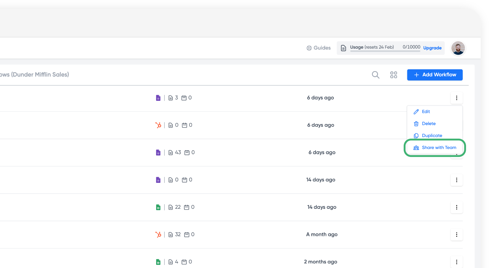
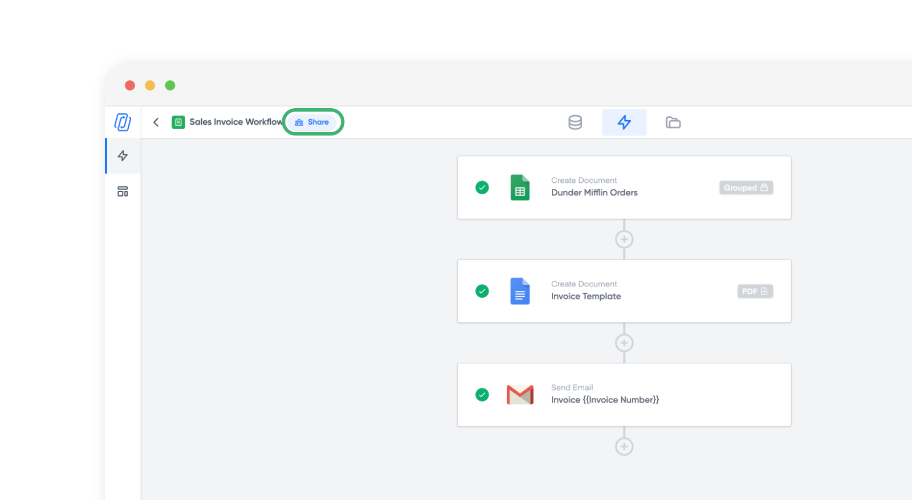
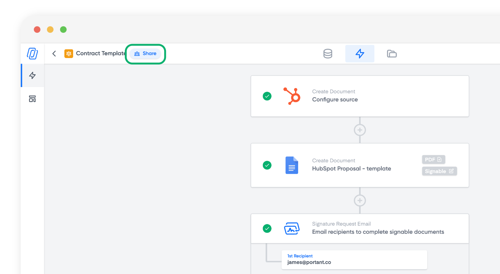
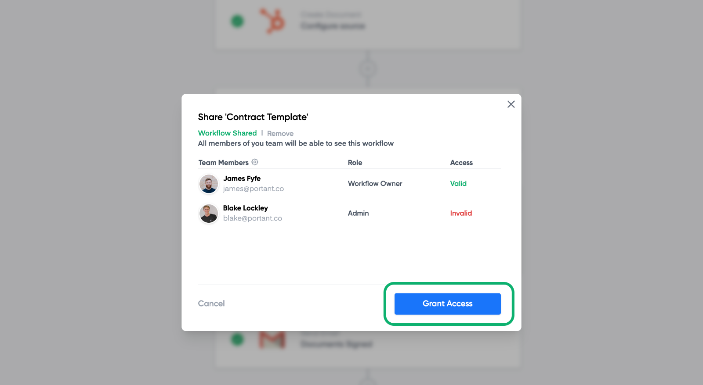
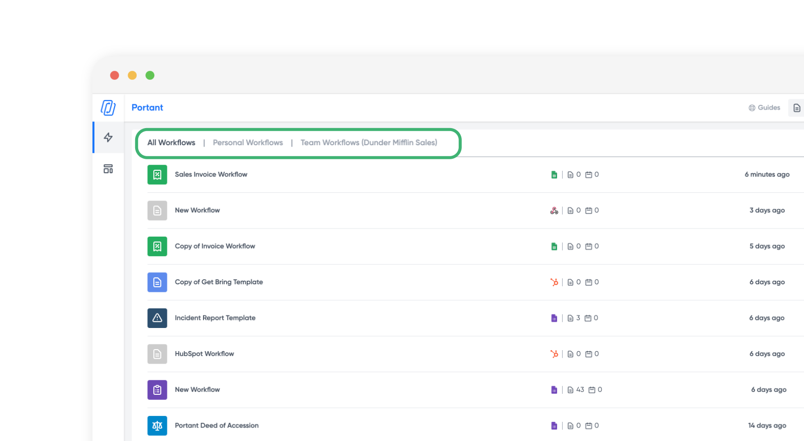
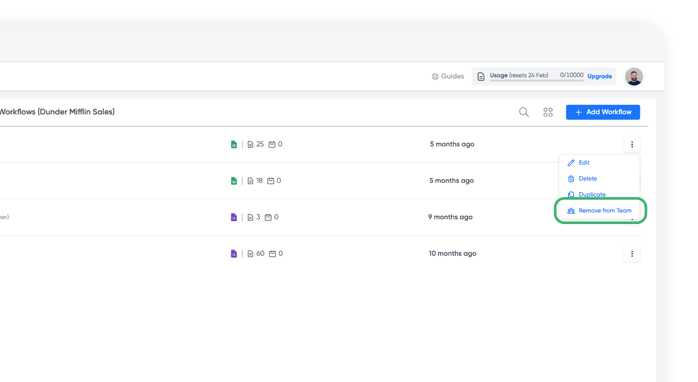

# Sharing Workflows

You might have a large team that needs the same workflow, or you're preparing for someone's absence. Sharing a workflow has many benefits. Check out this article on how to share a workflow in Portant.

In this article you will learn how to:

1. Share a workflow with a team member
2. File and Folder permissions required for a Team Member to run a Workflow
3. Access your shared workflows
4. Removing workflows from a team

**How to share a Workflow with a team member**

To share a workflow with a team member you need to have [upgraded to the teams plan](https://www.portant.co/pricing) and [added members to your team](creating-your-team.md#invite-a-team-member).&#x20;

Then click the kebab icon (⋮) and select share workflow with team.

<figure><figcaption></figcaption></figure>

After you have shared your workflow with your team, all members of your team will be able to access the workflow with the [permissions the Team Owner or Admin has set](managing-team-permissions.md) for each member.

You can also share a workflow with your team from the workflow page by clicking the Share button next to the workflow name here:

<figure><figcaption></figcaption></figure>

#### File and Folder permissions required for a Team Member to run a Workflow

When you share a workflow with your team, Portant will automatically share the files and folders in your workflow with your team members in accordance with your team members [Portant permission level](managing-team-permissions.md). For example:

|             | Workflow File Permission | Output Folder Permission |
| ----------- | ------------------------ | ------------------------ |
| Viewer      | View                     | View                     |
| User/Runner | View                     | Editor                   |
| Editor      | Editor                   | Editor                   |
| Admin       | Editor                   | Editor                   |
| Owner       | Editor                   | Editor                   |

The minimum permissions needed to run a workflow is View Access for all the files in the Workflow (Source and Template files) **AND** Editor access to the Output folder.

You can check these permissions at any time by clicking the 'Share' button here:

<figure><figcaption></figcaption></figure>

Then each team member will be displayed along with if their access to the workflow's files and folder is **valid** or **invalid**. If any of your team members don't have access, then you can grant access by clicking the 'Grant Access' button here:

<figure><figcaption></figcaption></figure>

#### **How to access your shared workflows**

When you have been added to a team, three new tabs will appear at the top of your workflow list here:

<figure><figcaption></figcaption></figure>

These are:

* **All Workflows** - These are both your personal and Team workflows
* **Personal Workflows** - These are only your personal workflows
* **Team Workflows** - These are only the workflows shared with your team

#### Removing Workflows from a team

To remove workflows from being shared with a team click the kebab icon (⋮) and select 'Remove from team'.

<figure><figcaption></figcaption></figure>

> **Note** | When your remove a workflow from a team you must managed the Google Drive permissions separately. Remember to check the Source and Template files and also to the output folder and output files to make sure they are shared with the correct people.

#### **Feedback and feature suggestions**

We created Portant in 2021, and the feedback we have received since then has been very helpful and greatly appreciated. If you have any feedback, please feel free to send us an email at contact@portant.co
