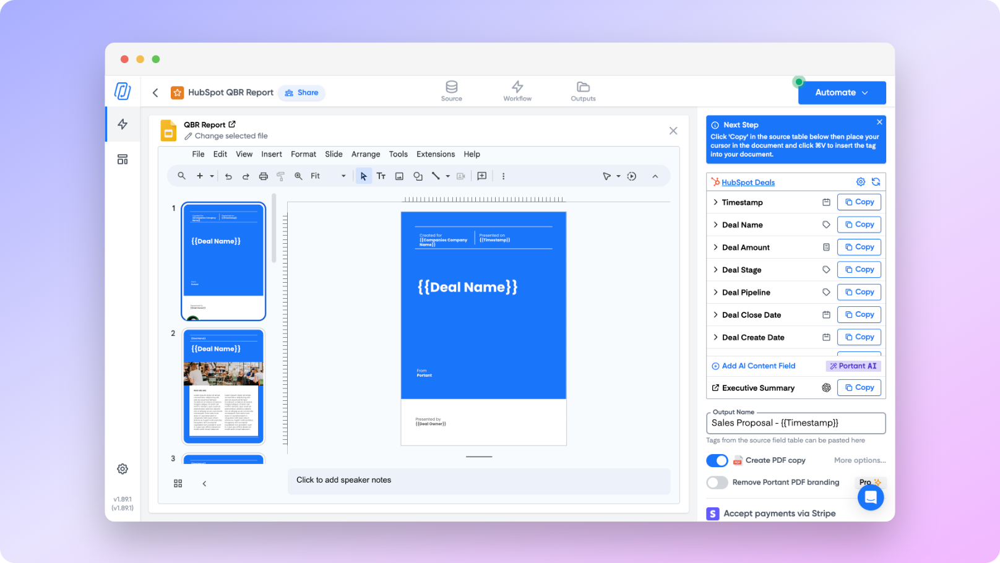

# Quarterly Business Reviews

Quarterly Business Reviews (QBRs) are essential for tracking customer engagement and ensuring client satisfaction. By integrating HubSpot as a data source with Portant, you can automate the entire QBR process, reducing manual effort and improving efficiency.

In this article, you will learn how to:

1. **Connect HubSpot to Portant**
2. **Create a new workflow**
3. **Customize your QBR template**
4. **Automated your QBRs**

> _Plus, how one of our customers is saving **hundreds of hours each quarter using this workflow**)_

<figure><figcaption></figcaption></figure>

#### Step 1: Connect HubSpot to Portant

Connect Portant to HubSpot, which will be your data source for the QBR workflow.

* **Install Portant’s HubSpot App**: If this is your first time using HubSpot as a source in Portant, you’ll need to [install the Portant App for HubSpot](../sources/hubspot/how-to-install-the-portant-app-in-hubspot/).

***

<figure><figcaption></figcaption></figure>

#### Step 2: Create a New Workflow

The next step is to set up a new workflow in Portant.

* **Login to Portant**: Start by signing in to your Portant account. If you don’t have one, you can sign up through the Portant website.
* **Create a New Workflow**: Click the blue “New Workflow” button at the top right of the page. This will initiate your QBR automation setup.
* **Select HubSpot as a source:** then [Select the primary object](../sources/hubspot/how-to-manage-and-select-hubspot-properties/) (e.g., Deal, Contact, Company) from which Portant will pull data for the QBR:
  * **Contact**: If you're reviewing customer engagement, relationship quality, or specific interactions with individual customers.
  * **Company**: If the focus is on account-level performance, customer segmentation, and overall business impact with specific companies.
  * **Deal**: If the review emphasizes sales pipeline performance, revenue growth, deal stages, and conversion rates.

<figure><figcaption></figcaption></figure>

***

#### Step 3: Customize Your QBR Template (with Customer Health Score)

Once HubSpot is linked, it’s time to customize your document template for QBRs.

<figure><figcaption></figcaption></figure>

* **Select a Template**: Choose a Google Doc, Slide, or email template to be used for your QBR reports.

<figure><figcaption></figcaption></figure>

* **Add Dynamic Tags**: Insert HubSpot property tags (e.g., \{{Customer Name\}}, \{{Health Score\}}) into the document to personalize each QBR automatically. You can manage which HubSpot fields are available for use in the template by clicking “Manage HubSpot Fields.”
* **Optional**: Customize the document’s output format and file naming conventions based on customer-specific data.

***

<figure><figcaption></figcaption></figure>

#### Step 4: Generate Your First QBR Report (manually)

After setting up your template, generate your first automated QBR report:

* **Go to HubSpot**: Navigate to your HubSpot account and open the page of the selected primary object (Deal, Contact, etc.).
* **Run the Workflow**: In the right-hand panel, click the “Actions” button and select the workflow you just created. The system will generate a QBR report, pulling data from the selected HubSpot object. A link to the generated document will appear in the HubSpot side panel.

***

<figure><figcaption></figcaption></figure>

#### Step 5: Automate your QBRs&#x20;

Once your workflow is set up and tested, you can trigger Portant to create the QBR from a HubSpot workflow:

* **Automate the Workflow**: Enable auto-creation by building a [Workflow in HubSpot and adding the Portant action to it](../sources/hubspot/add-a-portant-action-to-a-hubspot-workflow.md). This will ensure that QBR reports are generated automatically based on pre-set criteria, such as quarterly triggers or specific deal stages.
* **Test the Workflow**: Submit a test entry in HubSpot to ensure the workflow runs smoothly and generates the expected QBR output.

***

#### **Feedback and feature suggestions**

We created Portant in 2021, and the feedback we have received since then has been very helpful and greatly appreciated. If you have any feedback, please feel free to send us an email at contact@portant.co
